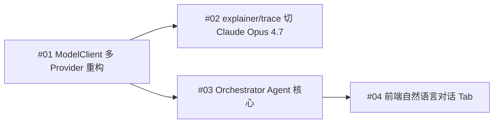

# PLANNING.md

## 项目概述
- 一句话描述：墨西哥市场多 Agent 用户画像后端
- 整体架构：单体 FastAPI 后端，五层（API → 编排 → Skill 执行 → 数据访问 → 外部服务）
- 入口文件：`app/main.py`

## 开发指导入口

- 当前项目是 **Codex-first**：项目级开发规则以 `AGENTS.md` 为准。
- `CLAUDE.md` 仅保留为 Claude Code 历史兼容入口，不能再作为独立规则源维护。
- `.codex/config.toml` 只保存 Codex 配置，不承载长篇开发规范。
- 架构、边界、已知约束和参考代码路径维护在本文档；任务状态维护在 `TASK.md`。
- 非平凡改动必须先做 Harness layer impact 判断：信息边界、工具接口、执行编排、记忆/状态、评估/观测、约束/恢复。
- 跨层改动、公共契约改动、新模块、新路由、Prompt 契约变化必须先更新或新增 `docs/specs/` 与 `docs/plans/`，再实施代码改动。
- Harness Engineering 详细治理方法见 `docs/specs/harness-engineering-governance.md`；只有复杂改动或架构判断时按需读取，不塞入 `AGENTS.md`。

## 现有目录结构

标注符号：
- ✅ 已实现
- ⭐ 新模块照这个风格写
- ⚠️ 需重构
- 🗑️ 待废弃
- 🔲 未来新增（当前不存在）

```
MAPS-LZ/
├── app/
│   ├── main.py                          ✅ FastAPI 入口（53 行）
│   ├── api/
│   │   ├── analyze.py                   ✅ /api/analyze + /api/analyze-file + /api/ui-config 路由
│   │   ├── analyze_module.py            ✅ /api/analyze-module 模块级渐进加载端点（2026-05-02）
│   │   ├── analyze_stream.py            ✅ /api/analyze-stream SSE 端点（保留，前端已切换到 analyze-module）
│   │   └── trace.py                     ✅ GET /api/trace/{uid}（已挂载 main.py）
│   ├── services/
│   │   ├── orchestrator.py              ✅ AnalysisOrchestrator + SkillRegistry 装配 + shared_orchestrator 单例 + 模块级缓存 + analyze_module()
│   │   ├── batch_service.py             ✅ 批量分析封装
│   │   └── report_renderer.py           ✅ Markdown 报告渲染
│   ├── runtime_skills/
│   │   ├── base.py                      ✅ BaseSkill + SkillRegistry（141 行）
│   │   ├── app_profile_agent.py         ⭐ AppProfileSkill 入口（六步管线参考）
│   │   ├── app_profile/                 ⭐ 六步管线参考实现
│   │   │   ├── contracts.py             ✅ TypedDict 契约
│   │   │   ├── data_access.py           ✅
│   │   │   ├── feature_builder.py       ✅
│   │   │   ├── decision_engine.py       ✅
│   │   │   ├── explainer.py             ✅ LLM 调用层
│   │   │   └── assembler.py             ✅
│   │   ├── behavior_profile_agent.py    ✅
│   │   ├── behavior_profile/            ✅ 六步管线（结构与 app_profile 对齐）
│   │   ├── credit_profile_agent.py      ✅
│   │   ├── credit_profile/              ✅ 六步管线（结构与 app_profile 对齐）
│   │   ├── comprehensive_agent.py       ✅ 薄入口（≤ 80 行）
│   │   ├── comprehensive/               ✅ 六步管线（结构与 app_profile 对齐）
│   │   ├── product_advice_agent.py      ⭐ stage=2 入口（当前 stub，业务逻辑见 docs/specs/operation-skills-design.md）
│   │   ├── product_advice/              ⭐ 六步管线骨架（contracts 已扩展，5 子层 NotImplementedError 占位）
│   │   ├── ops_advice_agent.py          ⭐ stage=2 入口（当前 stub，业务逻辑见 docs/specs/operation-skills-design.md）
│   │   ├── ops_advice/                  ⭐ 六步管线骨架（contracts 已扩展，5 子层 NotImplementedError 占位）
│   │   └── trace_analyzer/              ⭐ 独立服务模块（非 SkillRegistry Skill，按需 GET 端点；docs/specs/trace-analyzer-design.md，2026-05-01）
│   │       ├── analyzer.py              ⭐ 入口（Step 3 stub，无 _agent 后缀，避免误读为 BaseSkill）
│   │       ├── contracts.py             ✅ TypedDict 契约（5 个 TypedDict 真实定义）
│   │       ├── data_access.py           ⭐ Step 3 stub（NotImplementedError）
│   │       ├── feature_builder.py       ⭐ Step 3 stub（NotImplementedError）
│   │       ├── decision_engine.py       ⭐ Step 3 stub（NotImplementedError）
│   │       ├── explainer.py             ⭐ Step 3 stub（NotImplementedError）
│   │       └── assembler.py             ⭐ Step 3 stub（NotImplementedError）
│   ├── core/
│   │   ├── config.py                    ✅ Settings（dotenv + env override）
│   │   ├── model_client.py              ✅ ModelClient（mock / gemini / vertex）
│   │   └── logger.py                    ✅
│   ├── repositories/
│   │   ├── base.py                      ✅ BaseUserRepository 抽象（22 行）
│   │   ├── local_repository.py          ✅ 本地文件后端
│   │   └── warehouse_repository.py      ✅ 数仓后端 stub
│   ├── schemas/
│   │   ├── final_response.py            ✅ AgentOutput / UserAnalysisResult / AnalyzeResponse（已扩展 product_advice / ops_advice 为 Optional）
│   │   ├── request.py                   ✅
│   │   ├── response.py                  ✅
│   │   ├── app_profile.py               ✅
│   │   ├── behavior_profile.py          ✅ 已补全强类型子模型（2026-04-30，4 sub-models + 3 top-level levels）
│   │   ├── credit_profile.py            ✅ 已补全强类型子模型（2026-04-30，4 sub-models + 5 top-level levels）
│   │   ├── comprehensive_profile.py     ✅
│   │   ├── product_advice.py            ⭐ ProductAdviceStructuredResult（Step 3 stub）
│   │   ├── ops_advice.py                ⭐ OpsAdviceStructuredResult（Step 3 stub）
│   │   └── trace_analyzer.py            ✅ TraceAnalyzeResponse + 7 子 model（Pydantic 真实定义，2026-05-01）
│   ├── country_packs/
│   │   ├── app_profile.py / behavior_profile.py / credit_profile.py
│   │   └── mx/                          ✅ 墨西哥市场配置（已新增 segments.py / product_advice_rules.py / ops_advice_rules.py 占位）
│   ├── prompts/                         ✅ Markdown prompt 模板
│   ├── scripts/
│   │   ├── data_prep/                   ✅ UID 切分 / 数据预处理
│   │   ├── chart_builder.py             ✅
│   │   └── ...                          ✅
│   ├── ui/
│   │   ├── live_frontend.py             ✅ 已删除（2026-04-30，拆分到 app/static/ + build_frontend.py）（docs/specs/ui-separation-design.md）
│   │   └── mock_frontend.py             ✅
│   ├── static/                          ✅ 前端 JSX/JS 组件（build_frontend.py 拼接 38 文件）
│   │   └── js/
│   │       ├── app.jsx                  ✅ 顶层入口（渐进加载 + 假动画过渡，2026-05-02 重写）
│   │       ├── utils/                   ✅ normalize.js / chartLookup.js / displayMappers.js / advice.js
│   │       ├── services/api.js          ✅ analyzeByUid / analyzeByFile / analyzeModule / fetchUiConfig / fetchTrace
│   │       ├── components/
│   │       │   ├── HomeView.jsx         ✅ UID 输入 + 文件上传
│   │       │   ├── LoadingView.jsx      ✅ 假动画轮播过渡页（2026-05-02 增强）
│   │       │   ├── ProgressView.jsx     ✅ SSE 进度展示（保留，前端不再默认使用）
│   │       │   ├── DashboardView.jsx    ✅ 7-tab Dashboard + ModuleStatusPanel 集成（2026-05-02）
│   │       │   ├── common/
│   │       │   │   ├── ModuleStatusPanel.jsx  ✅ 四态模块包裹组件（2026-05-02 新增）
│   │       │   │   ├── LabelsOverviewCard.jsx ✅ 标签概览卡
│   │       │   │   └── ...              ✅ InfoRow / ProgressRow / MarkdownBlock / MetricHelpTip 等 10 个
│   │       │   ├── charts/              ✅ DonutChart / CreditGauge / CreditRiskStructure
│   │       │   └── panels/
│   │       │       ├── AppPanel.jsx     ✅ 含大模型分析报告卡片
│   │       │       ├── BehaviorPanel.jsx ✅ 四大卡片 + Timeline + LLM 大纲摘要（2026-05-02 修复乱码）
│   │       │       ├── RichCreditPanel.jsx ✅
│   │       │       ├── ComprehensivePanel.jsx ✅
│   │       │       ├── ProductAdvicePanel.jsx ✅
│   │       │       ├── OpsAdvicePanel.jsx ✅
│   │       │       └── trace/           ✅ TracePanel + 6 子组件（2026-05-02 注册 LOAD_ORDER）
│   ├── utils/                           ✅
│   └── agents/                          ✅ 已删除（2026-04-28）
├── tests/
│   ├── test_app_profile_phase1.py       ✅ 参考测试结构
│   ├── test_behavior_profile_phase18.py ✅
│   ├── test_credit_profile_phase17.py   ✅
│   ├── test_data_prep_phase15.py        ✅
│   └── test_data_prep_phase16.py        ✅
├── data/                                ✅ 仅追踪 .gitkeep
├── docs/                                ✅ 已存在（内容未读取，Plan 阶段确认）
├── outputs/                             ✅ 运行产物（git 忽略）
├── .agents/skills/                      🗑️ Codex 编辑器辅助技能，不参与运行时（不修改）
├── data_acquisition_agent/              ✅ 顶层独立 package（AGENTS.md / 本文档受控例外，V1 已实现 2026-04-29）
│   ├── __init__.py                      ✅ 空
│   ├── demo0/                           ✅ 知识库源材料（已脱敏，764a647 已追踪）
│   ├── configs/                         ✅ YAML manifest 数据目录
│   │   ├── mexico.yaml                  ✅ V1 验证国家（真实路径已填）
│   │   ├── indonesia.yaml               🔲 留位（placeholder，V1 不验证；未来扩展前需补 yaml 字段）
│   │   ├── pakistan.yaml                ⏸️ 已填 yaml（未来扩展接口；V1 不进测试矩阵）
│   │   ├── thailand.yaml                ✅ V1 验证国家（真实路径已填）
│   │   └── philippines.yaml             ⏸️ 已填 yaml（未来扩展接口；V1 不进测试矩阵）
│   ├── api.py                           ✅ FastAPI router（POST /generate + POST /execute 已接编排）
│   ├── orchestrator.py                  ✅ 端到端编排（manifest→redact→assemble→LLM→scan→response）
│   ├── manifest.py                      ✅ CountryManifest YAML 加载与校验
│   ├── prompt_assembler.py              ✅ prompt 拼装 + CJK token 估算 + 800K 阈值
│   ├── redactor.py                      ✅ L1 凭据脱敏（11 family）
│   ├── output_scanner.py                ✅ L2 输出扫描 + Python 黑名单（8 条）+ DDL 策略
│   ├── schemas.py                       ✅ Pydantic 请求/响应/错误 model + validators（V1+V2 完整）
│   ├── connection.py                    ✅ V2 实现（2026-04-30）— env→pymysql 短生命周期 StarRocks 连接
│   ├── executor.py                      ✅ V2 实现（2026-04-30）— 守门 + COUNT 预检 + execute_query + run_execute_pipeline
│   ├── output_writer.py                 ✅ V2 实现（2026-04-30）— bucket 切片 + schema 校验 + .tmp + os.replace
│   └── tests/                           ✅ 163 passed + 1 skipped（V1 72 + V2 71 + real-LLM skip）
│       ├── __init__.py                  ✅ 空
│       ├── test_redactor.py             ✅ 15 tests
│       ├── test_manifest.py             ✅ 3 tests
│       ├── test_prompt_assembler.py     ✅ 9 tests
│       ├── test_output_scanner.py       ✅ 25 tests
│       ├── test_schemas.py              ✅ 10 tests（V1 5 + V2 5）
│       ├── test_e2e_mock_llm.py         ✅ 1 test
│       ├── test_smoke_real_llm_mexico.py 🔲 Stub（pytest skip）
│       ├── test_connection.py           ✅ 5 tests（V2）
│       ├── test_executor.py             ✅ 22 tests（V2）
│       ├── test_output_writer.py        ✅ 14 tests（V2）
│       ├── test_api_v2.py               ✅ 9 tests（V2）
│       └── test_e2e_mock_executor.py    ✅ 16 tests（V2 T1-T4 + happy path）
├── config.yaml                          ✅
├── requirements.txt                     ✅
├── .gitignore                           ✅
├── .env.example                         ✅ 已清理为占位符
└── key.json                             🔒 凭据，git 忽略
```

## 目标目录结构（未来新增）

- ⭐ `app/runtime_skills/comprehensive/` — Stub 已建，六步管线骨架就位（contracts / data_access / feature_builder / decision_engine / explainer / assembler），实现按 docs/plans/comprehensive-refactor-plan.md 推进
- ✅ `app/runtime_skills/product_advice/` — 产品策略 Skill，stage=2，依赖 `comprehensive_profile`（已建 Stub）
- ✅ `app/runtime_skills/ops_advice/` — 运营策略 Skill，stage=2，依赖 `comprehensive_profile`（已建 Stub）
- ⭐ `app/runtime_skills/trace_analyzer/` — 单用户埋点深度解析（独立服务模块，**不进 SkillRegistry**，按需 GET /api/trace/{uid}）。Step 3 架构 Stub 已落地（2026-05-01）：六步管线骨架（analyzer/contracts/data_access/feature_builder/decision_engine/explainer/assembler）+ 路由 stub（app/api/trace.py，未挂载 main.py）+ Pydantic 出口（app/schemas/trace_analyzer.py，真实定义）+ prompt 占位（app/prompts/trace_analyzer_prompt.md）。Design Doc：[docs/specs/trace-analyzer-design.md](docs/specs/trace-analyzer-design.md)。
- ✅ `docs/specs/sse-progress-design.md` — SSE 进度推送 Design Doc（2026-05-01，Q1-Q6 全部锁定，Step 5 实现）
- ✅ `docs/specs/` — Design Doc 落地点（已新增 `data_acquisition_agent.md`）
- ✅ `docs/plans/` — Plan 文档落地点（已有 data-acquisition-v1-plan.md）
- ✅ `docs/reviews/` — 审计 / Review 报告
- ✅ `data_acquisition_agent/` — 顶层独立 Python package（AGENTS.md / 本文档受控例外）。**V1 已实现**（2026-04-29，72 tests），墨西哥 mob1 验证。**V2 已实现**（2026-04-30，71 tests，全量 163 passed）：受控执行层——分析师审核后 SQL → query_only 执行 → bucket 切片 → per-uid 文件落地。Design Doc：[docs/specs/data_acquisition_agent.md](docs/specs/data_acquisition_agent.md)。V2 Design Doc：[docs/specs/data_acquisition_agent_v2.md](docs/specs/data_acquisition_agent_v2.md)。V2 Plan：[docs/plans/data-acquisition-v2-plan.md](docs/plans/data-acquisition-v2-plan.md)。

画像 Skill 的具体字段、stage 间数据形状、与 LangGraph 的对齐方式留待 Plan 阶段确认。`data_acquisition_agent` 不是 SkillRegistry Skill，不适用 BaseSkill / stage 注册规则。

## 技术选型

来自 `requirements.txt`：

- `fastapi >=0.115,<1.0` — Web 框架
- `uvicorn[standard] >=0.32,<1.0` — ASGI server
- `pydantic >=2.9,<3.0` — schema 校验
- `pandas >=2.2,<3.0` — 数据处理
- `python-dotenv >=1.0,<2.0` — 环境变量
- `jinja2 >=3.1,<4.0` — 模板
- `python-multipart >=0.0.12` — 文件上传
- `google-genai >=1.0,<2.0` — Gemini / Vertex AI 客户端
- `pyyaml >=6.0,<7.0` — YAML manifest 加载（da-agent V1 新增）

运行命令：
- 启动服务：`uvicorn app.main:app --reload`
- 跑测试：`python -m pytest tests/ -v`

## 数据流向

> **Business Stage 0**：`data_acquisition_agent` 属于业务 Stage 0：自然语言取数需求 → 生成待审核 SQL/Python artifact → 分析师人工审核与执行 → 产出数据文件 → 进入现有画像流程。该阶段不属于 Runtime SkillRegistry stage 编号体系。

```
UID list
  ↓ POST /api/analyze 或 /api/analyze-file
AnalysisOrchestrator._analyze_single_user(uid)
  ↓
SkillRegistry.run_all(uid, repository, application_time)
  │
  ├── stage 0（并行 max_workers=3）
  │     ├── AppProfileSkill        → app_profile
  │     ├── BehaviorProfileSkill   → behavior_profile
  │     └── CreditProfileSkill     → credit_profile
  │
  ├── stage 1（串行）
  │     └── ComprehensiveProfileSkill（depends_on 上述三者）→ comprehensive_profile
  │
  └── ✅ stage 2（已建 Stub，并行）
        ├── ProductAdviceSkill（depends_on=["comprehensive_profile"]）
        └── OpsAdviceSkill（depends_on=["comprehensive_profile"]）
  ↓
UserAnalysisResult(uid, app_profile, behavior_profile, credit_profile, comprehensive_profile)
  ↓
AnalyzeResponse(results=[...])  → JSON
```

### 旁路链路：Trace Analyzer（独立按需端点，不进 SkillRegistry）

```
GET /api/trace/{uid}
  ↓
app/api/trace.py
  ↓
TraceAnalyzer.analyze(uid)              # app/runtime_skills/trace_analyzer/analyzer.py
  ↓
TraceDataAccess.fetch(uid)              # 直接读 data/behavior/by_uid/{uid}.csv（不走 Repository）
  ↓
TraceFeatureBuilder.build()             # 5 类规则事实 + 三层 token 护栏
  ↓
TraceDecisionEngine.decide()            # 组装 prompt_payload + 模板兜底
  ↓
TraceExplainer.explain()                # ModelClient.generate_structured()
  ↓
TraceAssembler.assemble()
  ↓
TraceAnalyzeResponse (Pydantic) → JSON
```

**与主链路的关系**：完全解耦。trace 不依赖 behavior_profile 的 prepared_record（直接读原始 CSV）；trace 输出的 churn_root_cause 与 ops_advice 的 6 种候选值兼容但**不回灌**——仅供前端展示。详见 docs/specs/trace-analyzer-design.md §7。

### 旁路链路：模块级渐进加载（前端按需请求）

```
前端 UID 输入 → 假动画过渡页（uidTransitionDurationMs 可配）
  ↓ 过渡时间到 → 进入 Dashboard
  ↓ 同时后台并行请求 3 个核心模块
GET /api/analyze-module?uid=xxx&module=app
GET /api/analyze-module?uid=xxx&module=behavior
GET /api/analyze-module?uid=xxx&module=credit
  ↓ 每个模块完成 → 前端渲染 + ModuleStatusPanel 状态切换
  ↓ 3 个核心全部成功 →
GET /api/analyze-module?uid=xxx&module=comprehensive
  ↓ comprehensive 成功 →
GET /api/analyze-module?uid=xxx&module=product
GET /api/analyze-module?uid=xxx&module=ops
  ↓ 失败的模块：显示错误 + 重试按钮

shared_orchestrator._module_cache 缓存已完成的模块结果，
comprehensive 请求时优先从缓存取 app/behavior/credit 结果。
```

## 核心设计决策

- **规则引擎 + LLM 双轨**：每个 Skill 先用规则跑出 deterministic fallback，再用 LLM 生成 explanation；LLM 失败时降级返回 fallback。
- **BaseSkill + SkillRegistry**：所有 Skill 实现统一签名 `analyze(uid, **kwargs)`；Registry 按 stage 调度并自动注入 `<dep>_result`。
- **Country Pack**：地区相关配置（墨西哥）抽到 `app/country_packs/mx/`，未来扩展到其他国家时新增子包。
- **Repository 抽象**：`BaseUserRepository` → `LocalUserRepository` / `WarehouseUserRepository`，由 `settings.data_source` 切换。
- **mock/real 切换**：`ModelClient.mode = "mock" | "gemini" | "vertex"`，所有 Skill 必须支持 mock 降级。
- **TypedDict 管线契约**：六步管线之间使用 TypedDict（参考 `app/runtime_skills/app_profile/contracts.py`）显式声明形状。

## 模块间依赖关系

从代码 import 提取的关键调用链：

```
app.main
  ├─ app.api.analyze                      ✅ 同步路径：/api/analyze + /api/analyze-file
  │    └─ app.services.batch_service
  │         └─ app.services.orchestrator (AnalysisOrchestrator)
  │              ├─ app.core.config (settings)
  │              ├─ app.core.model_client (ModelClient)
  │              ├─ app.repositories.local_repository / warehouse_repository
  │              ├─ app.runtime_skills.base (SkillRegistry)
  │              └─ app.runtime_skills.{app,behavior,credit}_profile_agent
  │                    └─ app.runtime_skills.{xxx}_profile.* (六步管线)
  │                           └─ app.country_packs.* / app.utils.*
  └─ app.api.analyze_stream               ⭐ SSE 路径：/api/analyze-stream（Step 5 实装）
       └─ app.services.orchestrator (AnalysisOrchestrator)
            └─ progress_callback: Callable[[dict], None]  # 透传至 SkillRegistry.run_all
                 # callback 由 SSE 端点提供，通过 queue.Queue 桥接到主协程的 event_gen()
                 # /api/analyze 路径不传 callback（默认 None），行为零变化
```

`comprehensive_agent.py` 直接依赖 `app.schemas.comprehensive_profile`、`app.scripts.chart_builder`、`app.services.report_renderer`、`app.utils.pydantic_compat`。

## 未来扩展（Orchestrator Agent 矩阵）

> 2026-05-12 新增。围绕 Plan #01-#04 的 4 个特性形成依赖矩阵，详细 Design Doc 见 `docs/specs/01..04`。

### 特性依赖关系（Mermaid）



- `#01` 是基础设施，独立有价值；完成后即可 commit `[complete]`。
- `#02` 与 `#03` 互不依赖，可并行（前提：`#01` 已完成）。
- `#04` 强依赖 `#03`：后端 SSE 接口 + `/api/orchestrator/sessions/{id}` GET 路由就绪后才启动。
- 4 个 Plan 的 Phase 划分都满足"每 Phase 1 commit、最多 4 个 commit、最后一个标 `[complete]`"。

### Surgical Hard Boundary

按 Karpathy "surgical changes" 准则，本次 4-feature 落地对以下区域**严格禁止改动**：

- `data_acquisition_agent/` 任何 `.py`：163 tests 锁定，仅 Plan #03 Phase 1 Task 1.4 通过 import 调用
- 现有 `tests/` 270 个测试用例文件不动；新功能只追加新测试文件
- 现有 7 个 Tab 的展示组件（`app/static/js/components/panels/{App,Behavior,Credit,Comprehensive,Trace,ProductAdvice,OpsAdvice}Panel.jsx`）不动；Plan #04 只新建 `panels/chat/` 子目录

## 已知约束

- **Codex 主入口**：`AGENTS.md` 是当前项目级开发规则的唯一主入口；`CLAUDE.md` 仅做历史兼容转发，新增规则不得只写入 `CLAUDE.md`。
- **Harness 变更门禁**：非平凡改动必须说明影响的 Harness 层；如果影响跨层契约、状态、工具、安全、评估或恢复路径，必须先更新 Design Doc / Plan。详细口径见 `docs/specs/harness-engineering-governance.md`。
- LLM 调用必须经 `ModelClient`，不允许 Skill 直接 import `google.genai`。
- **Orchestrator Agent 单会话 token 预算 500K**：80% 触发前端黄色 banner，100% 强制中止本会话并写 `status=budget_exceeded`。详见 Plan #03 Phase 2 Task 2.3。
- **Maestro Spike 是 Plan #03 进入 Phase 1 的 Blocking Gate**：Plan #03 Phase 0 Task 0.2 必须验证 4 项（HTTP 200 / 协议字段 / 延迟 ≤ 5s / 配额）才能进 Phase 1。
  - **Spike 失败的逃生路径（C-1）**：(a) Plan #01 不阻塞、保留 Provider 抽象；(b) Plan #02 路由表暂不切 Claude（`claude_maestro` 实指 Gemini，等 Maestro 恢复后再切）；(c) Plan #03 改用 Gemini 2.5 Flash 跑通 MVP；(d) Plan #04 推迟到 Plan #03 MVP 跑通后再启动。逃生记录写入 `docs/reviews/maestro-spike-failure-{date}.md`。
- **Surgical 边界**：见上节"Surgical Hard Boundary"，违反此边界的改动不得合入。
- **`data_acquisition_agent/` 163 tests 锁定**：当前 163 passed (1 skipped) 是底线，Plan #03 通过 `query_data` 工具间接调用，但不得修改 `data_acquisition_agent/` 内任何文件。
- **国别白名单**：`country_code ∈ ["mx", "th"]`（V1 实际集合，Plan #05 v6.1 落地），Pydantic schema 强制；新增国别需先在 `docs/skills/orchestrator/{cc}.md` 落地规则文件。
- **双层 UID 校验（P1-3）**：
  - **Layer A 通用安全 regex**（安全层，详见 Doc #03 § 12.1）：`^[A-Za-z0-9_-]{1,64}$`，防注入 / 路径穿越 / prompt injection；所有从 LLM / 用户输入拿到的 UID 必须先过此校验。
  - **Layer B 国别业务 regex**（业务层，详见 Plan #03 Task 2.3 `uid_whitelist.py`）：6 国各自更严格的业务 pattern（例如 th 长度 8-32），具体 pattern 在 Plan 阶段与业务方确认后回填。
  - 两层互不替代：Layer A 过不了报错；Layer A 过了但 Layer B 过不了 → 该 UID 丢弃但不中断会话。
- **Agent Loop 最大轮次 MAX_ROUNDS=15**：超过即写 `status=error` 并返回错误事件，避免无限循环。

## 未来扩展规划

本批 4 Plan 是 Orchestrator Agent V1。按“试点成功后封装成 Skill 推广”原则，V2 候选项：

1. **Skill 封装**：把 “NL → 画像分析链路” 封装成 ai-code-review 风格的 Skill，方便扩展到其他 Agent（如风控 Agent / 营销 Agent）。
2. **Persistent Memory**：V1 已从本地 JSON 原型升级为 SQLite + FTS5 长期记忆，支持 `user_id/project_id/country` 隔离、跨 session 召回、Memory Inspector 管理和离线 memory eval；短期聊天历史独立存放在 `outputs/orchestrator_sessions/`，只用于 session 恢复，不参与长期召回；向量数据库 / embedding 仅在 FTS 评估不达标或记忆规模增长后再进入 V2。
3. **Multi-tenant**：支持多分析师同时跑，session 隔离 + 配额隔离（突破当前全局 _ACK_PROVIDER 单例限制）。
4. **自动批跑**：`query_data` 加 `unattended` 变体支持夜间 cron（突破 ACK 限制），需高级凭据 + IT 安全审批。

V2 启动前必须重新走 Vibe Coding Step 2 Brainstorming + 新 Design Doc + 新 Plan，不能直接在 V1 4 Plan 上增量改动。
- 所有 Skill 输出必须满足 `AgentOutput` 形状（`summary` / `structured_result` / `charts` / `report_markdown`）。
- `data/` 下除 `.gitkeep` 外不入 git。
- `.agents/skills/` 不修改。
- 单文件 ≤ 500 行（`comprehensive_agent.py` 512 行已超标，待拆分）。

## 参考代码指引（与 AGENTS.md 一致）

- 新画像 Skill 入口 → `app/runtime_skills/app_profile_agent.py`
- 六步管线子文件 → `app/runtime_skills/app_profile/`
- Skill 注册 → `app/services/orchestrator.py` 的 `_build_registry()`
- TypedDict 契约 → `app/runtime_skills/app_profile/contracts.py`
- LLM 调用 → `app/runtime_skills/app_profile/explainer.py`
- 测试结构 → `tests/test_app_profile_phase1.py`
- Prompt 模板 → `app/prompts/app_profile_prompt.md`

## 更新记录
- [2026-04-28] 初始创建
- [2026-04-29] data_acquisition_agent V1 Step 3 架构 Stub 落地
- [2026-04-29] data_acquisition_agent V1 实现完成（72 tests，183 全量回归 0 failed，app/main.py 已 include_router）
- [2026-04-29] data_acquisition_agent V2 Design Doc 确认
- [2026-04-29] data_acquisition_agent V2 Step 3 架构 Stub 落地：connection.py / executor.py / output_writer.py + 4 测试 Stub；schemas.py 扩展 ExecuteRequest/Response + 6 新 ErrorType；api.py 扩展 /execute stub + HTTP 映射；app/core/config.py 新增 3 个非敏感字段（DA_MAX_RESULT_ROWS / DA_QUERY_TIMEOUT_SECONDS / DA_CONNECTION_PROFILE）；requirements.txt 新增 pymysql；.env.example 新增 DA_DB_* 占位符 + V2 非敏感配置
- [2026-04-30] data_acquisition_agent V2 Step 5 TDD 实现完成：6 Phase / 16 commits / 71 new tests（全量 163 passed, 1 skipped, 0 failed）
- [2026-04-30] Operation Skills（ProductAdvice / OpsAdvice）Step 2 Design Doc 确认（docs/specs/operation-skills-design.md）+ Step 3 架构骨架落地：六步管线子文件 / country_packs/mx/{segments,product_advice_rules,ops_advice_rules}.py / schemas/{product_advice,ops_advice}.py / final_response.py 扩展 Optional 字段 / orchestrator 回填，全量 278 passed 0 failed
- [2026-04-30] UI 前端分离 Step 2 Design Doc 确认（docs/specs/ui-separation-design.md，3e94dbe）
- [2026-04-30] UI 前端分离 Step 3 架构 Stub 落地：app/static/ 骨架（index.html + app.jsx + 三个 .gitkeep）+ app/main.py 挂载 StaticFiles 到 /static
- [2026-04-30] 前端新增产品策略 / 运营策略 panel + 标签概览卡 + S1-S6 批量统计（dd7c65f）：3 个新 JSX（ProductAdvicePanel / OpsAdvicePanel / LabelsOverviewCard）+ DashboardView 6-tab + LOAD_ORDER 注册，178 passed 0 failed 零回归
- [2026-05-01] SSE 进度推送 Step 2 Design Doc 确认（docs/specs/sse-progress-design.md，Q1-Q6 全部锁定）+ Step 3 架构 Stub 落地：app/api/analyze_stream.py（NotImplementedError stub）+ app/static/js/components/ProgressView.jsx（return null stub）。新增 SSE 路径模块依赖支链；/api/analyze 与 SkillRegistry.run_all 现有签名零变化（progress_callback 默认 None）
- [2026-05-01] trace_analyzer Step 2 Design Doc 确认（docs/specs/trace-analyzer-design.md，Q1-Q6 锁定）+ Step 3 架构 Stub 落地：六步管线骨架（runtime_skills/trace_analyzer/，contracts + schemas 真实定义，其他 5 子层 NotImplementedError 占位）+ app/api/trace.py 路由 stub（未挂载 main.py，待 Plan 单独 Task 配合 D2 协调）+ app/prompts/trace_analyzer_prompt.md 占位。全量回归 210 passed 0 failed
- [2026-05-01] A1 Golden Test 评估框架落地：tests/test_golden_behavior_comprehensive.py + tests/golden/runner.py + 5 个 fixture（4 behavior + 1 comprehensive smoke），三层断言 L1/L2/L3 + L3-d 跨 case quincena 差异化
- [2026-05-01] trace_analyzer 实装完成（docs/plans/trace-analyzer-plan.md）：六步管线全部 GREEN（24 + 3 = 27 新测试）+ /api/trace/{uid} 已挂载 main.py。零回归
- [2026-05-02] 前端渐进加载迁移（参考项目融合）：Phase A 后端（shared_orchestrator 单例 + 模块缓存 + /api/analyze-module + /api/ui-config）+ Phase B 前端（SSE → 模块级渐进加载 + 假动画过渡 + ModuleStatusPanel + trace 独立加载）+ BehaviorPanel 中文乱码修复 + 大纲 LLM 摘要。270 passed 0 failed
- [2026-05-25] Orchestrator Memory V1 落地：SQLite + FTS5 长期记忆、严格写入白名单、跨 session 召回、Memory Inspector 管理抽屉、软删除/归档/恢复、离线 memory eval runner。Checkpoint commit: `3c10d85`；行为契约见 `docs/specs/memory-behavior-contract.md`。
- [2026-05-26] Orchestrator Chat progress / memory UI contract：新增 `tool_progress` 模块级进度事件、只读短期会话历史列表、长期记忆状态文案边界；契约见 `docs/specs/orchestrator-chat-progress-memory-ui-contract.md`。
