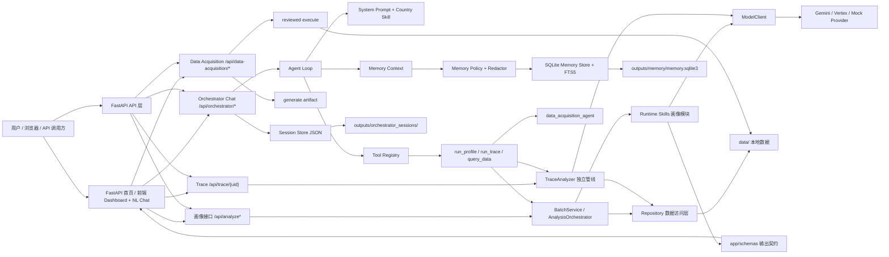
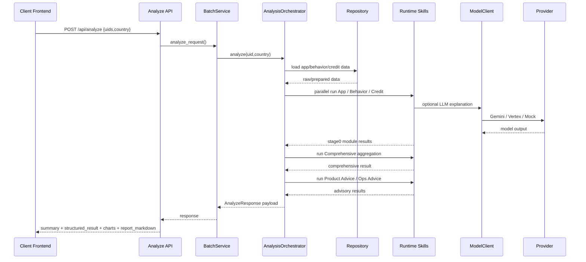
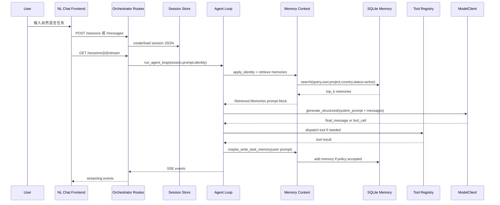
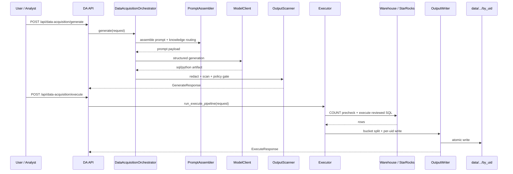
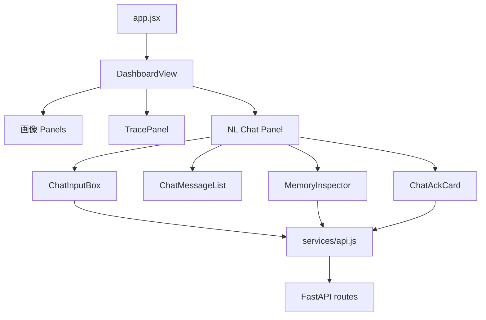
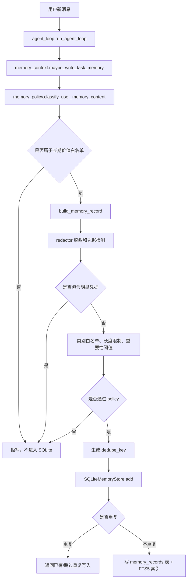
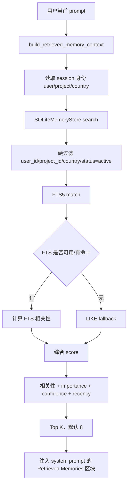
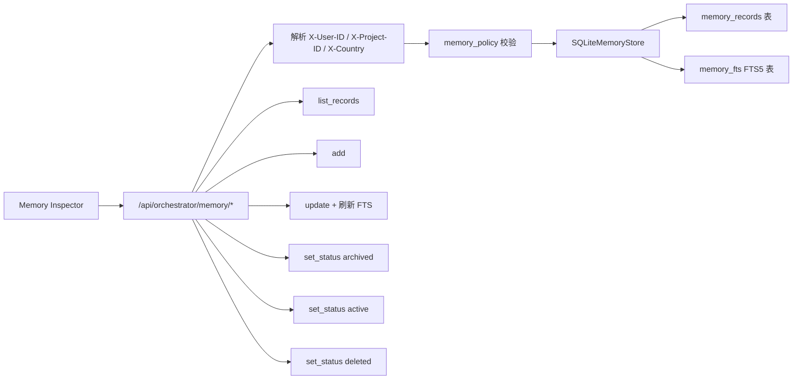

# Agent User Profile

面向墨西哥优先、多国家扩展的用户画像与自然语言分析项目。系统以 `uid` 为主键，聚合 App 使用、行为事件、信用数据或风险特征，输出结构化画像、图表数据、Markdown 报告，并提供 `/api/orchestrator/*` 自然语言聊天助手用于调用画像工具、追踪任务上下文、管理本地长期记忆，以及通过 `data_acquisition_agent` 做受控取数与数据回写。

当前项目可以理解为三条主能力，加一个独立的行为深挖模块：

- **画像主链路**：`App Profile`、`Behavior Profile`、`Credit Profile`、`Comprehensive Profile`，以及依赖综合画像的 `Product Advice`、`Ops Advice`
- **Orchestrator Chat 链路**：自然语言对话、工具调用、session 管理、SQLite 长期记忆、Memory Inspector 调试/管理面板、SQL 审核确认
- **Data Acquisition 链路**：自然语言生成 SQL / Python artifact，经人工审核后受控执行，并把结果回写到 `data/.../by_uid`
- **Trace Analyzer 独立能力**：单用户行为轨迹深挖，不进入主画像 SkillRegistry

第一版长期记忆只服务 Orchestrator Chat，不影响 App / Behavior / Credit / Comprehensive / Advice 画像主链路输出。

## 1. 当前能力概览

### 1.1 画像分析能力

画像主链路负责：

1. 接收一个或多个 `uid`
2. 从本地数据或后续仓储实现中读取用户数据
3. 分别运行 `App / Behavior / Credit`
4. 汇总为 `Comprehensive`
5. 在 `Comprehensive` 基础上继续给出 `Product Advice / Ops Advice`
6. 返回统一的 API 和前端展示结果

统一输出结构包括：

- `summary`
- `structured_result`
- `charts`
- `report_markdown`

顶层批量结果额外包含：

- `standardized_labels`

此外，前端默认已支持：

- 模块级渐进加载 `app / behavior / credit / comprehensive / product / ops`
- 单独触发 `trace` 深挖
- 单用户与批量 UID 两种分析模式

### 1.2 自然语言助手能力

`/api/orchestrator/*` 提供 NL Chat，用来把自然语言请求转成可执行分析步骤。当前支持：

- 创建、恢复和列出 chat session
- SSE 流式返回 agent 执行过程
- 以 visible execution 形式返回计划、执行步骤、review 和最终结论
- 通过工具调用画像、查询数据、运行 trace、解析 UID 文件
- cohort 场景下先做 clarification / resolution，再决定是否继续 query 或画像
- clarification 中若关闭 `auto_profile`，会在同一 execution 内只做 `query_data` 并直接返回 UID 列表与 SQL/行数信息
- 在同一 session 内保留短期上下文
- 通过 SQLite + FTS5 保存可跨 session 召回的长期记忆
- 对高风险 `query_data` 流程做“生成 artifact → 等待人工确认 → 执行”分步控制
- 当 Data Acquisition 不可用时，query/repair 相关步骤会以 `data_acquisition_unavailable` 明确阻断或降级，而不是静默失败
- 使用 Memory Inspector 在前端查看、搜索、新增、编辑、归档、恢复、软删除记忆

### 1.3 Data Acquisition 能力

`data_acquisition_agent` 是受控的自然语言取数子系统，当前支持：

- 将自然语言需求转成待审核 SQL / Python artifact
- 做 L1/L2 脱敏与危险输出扫描
- 对审核通过的 SQL 进行受控执行
- 将查询结果切片写回 `data/app|behavior|credit/by_uid`
- 作为主画像链路的上游数据准备能力使用
- 通过 `DATA_ACQUISITION_ENABLED` 做 tri-state capability gating：
  - 未设置：`auto`，依赖存在则挂载 `/api/data-acquisition/*`，缺依赖时跳过并在 Chat/repair 路径中明确 blocked
  - `false`：显式禁用，不挂载 Data Acquisition router，query/repair 统一不可用
  - `true`：显式要求启用，依赖缺失时启动直接报错

它不是 Runtime SkillRegistry 里的一个 skill，更接近“业务 Stage 0”。

### 1.4 当前没有做的事

为了保持第一版稳定，当前没有接入：

- embedding 模型
- Milvus / Qdrant / Redis / 外部向量库
- LangFuse
- dreaming / consolidation 后台归并任务
- 长期记忆对画像主链路结果的直接影响
- 多实例分布式 session / memory / ACK 协调

长期记忆目前采用本地 SQLite + FTS5，等评估集证明 FTS 召回质量不足后，再考虑 embedding / vector search。

### 1.5 国家支持现状

当前真实支持范围需要分开看：

- **主画像 API**：当前只正式支持 `mx` 和 `th`
- **`mx`**：主链路最成熟，App / Behavior / Credit / Comprehensive / Advice / Trace 都可运行
- **`th`**：可运行，但整体能力厚度弱于 `mx`，尤其 Credit 走的是 `risk_features` 路径
- **其他国家**：仓库中已有部分 skill 文档、country pack 或 manifest 痕迹，但尚未完整接入主画像链路

这意味着“代码里出现某个国家配置”不等于“主系统已经支持该国家的全链路能力”。

## 2. 目录结构

```text
MAPS-LZ/
├─ app/
│  ├─ api/                         # FastAPI 路由
│  ├─ core/                        # 配置、日志、模型客户端
│  ├─ country_packs/               # 国家化规则与配置
│  ├─ prompts/                     # 运行时 LLM prompt
│  ├─ repositories/                # 数据访问抽象
│  ├─ runtime_skills/              # App/Behavior/Credit/Comprehensive/Advice/Trace 模块
│  ├─ schemas/                     # API 响应契约
│  ├─ scripts/                     # 数据准备和辅助脚本
│  ├─ services/                    # 画像编排、Orchestrator Agent、Memory、标签构建
│  ├─ static/                      # 前端 JSX/CSS/静态资源
│  ├─ ui/                          # 前端构建入口
│  └─ utils/
├─ data/                           # 本地数据目录
├─ data_acquisition_agent/         # 受控的自然语言取数与数据回写子项目
├─ docs/                           # 方案、设计、行为契约、评审文档
├─ outputs/                        # 本地运行输出，默认不作为核心源码提交
├─ scripts/                        # 项目级脚本，例如 memory live E2E
├─ tests/                          # 单测、前端测试、golden/eval 测试
├─ .env.example
├─ requirements.txt
├─ requirements-dev.txt
├─ AGENTS.md
├─ PLANNING.md
├─ TASK.md
├─ PROJECT_DOCUMENTATION.md
└─ README.md
```

## 3. 核心目录说明

### 3.1 `app/api/`

API 路由层，只负责请求接入、参数校验、调用服务层和返回响应，不承载画像业务推理。

主要入口：

- `app/api/analyze.py`：`POST /api/analyze`、`POST /api/analyze-file`、`GET /api/ui-config`
- `app/api/analyze_stream.py`：`POST /api/analyze-stream`
- `app/api/analyze_module.py`：`GET /api/analyze-module`
- `app/api/trace.py`：`GET /api/trace/{uid}`
- `app/api/orchestrator_routes.py`：NL Chat、session、memory API
- `data_acquisition_agent/api.py`：`/api/data-acquisition/*`

### 3.2 `app/core/`

基础设施层：

- `app/core/config.py`：读取环境变量和运行配置，并加载 `config.yaml`
- `app/core/model_client.py`：统一模型调用 facade，按 route_key 切 provider
- `app/core/providers/`：Gemini、mock、Claude Maestro 等 provider 适配

### 3.3 `app/repositories/`

数据访问层，负责“去哪里拿数据”，不负责“怎么做画像”。

当前以本地文件 repository 为主，同时保留后续接数据库、数仓或服务 API 的扩展入口。

主要实现：

- `app/repositories/local_repository.py`：默认本地实现，读取 `data/.../by_uid`
- `app/repositories/warehouse_repository.py`：预留实现，当前仍为 stub

### 3.4 `app/runtime_skills/`

运行时业务模块层，是真正参与后端画像链路的代码。当前包括：

- `app/runtime_skills/app_profile_agent.py`
- `app/runtime_skills/behavior_profile_agent.py`
- `app/runtime_skills/credit_profile_agent.py`
- `app/runtime_skills/comprehensive_agent.py`
- `app/runtime_skills/product_advice_agent.py`
- `app/runtime_skills/ops_advice_agent.py`
- `app/runtime_skills/trace_analyzer/`

其中 `app_profile / behavior_profile / credit_profile / comprehensive / product_advice / ops_advice` 都已经是比较统一的六步管线：

- `contracts.py`：内部对象契约
- `data_access.py`：repository 到模块输入对象的适配
- `feature_builder.py`：特征提取
- `decision_engine.py`：规则判断或段位映射
- `explainer.py`：LLM 解释增强
- `assembler.py`：页面/API 输出装配

`trace_analyzer` 同样采用六步结构，但它是**独立服务模块**，不继承 `BaseSkill`，不注册进主画像 `SkillRegistry`。

### 3.5 `app/services/`

服务层承载画像主编排、标签装配和聊天 Agent Harness。

主画像相关：

- `app/services/orchestrator.py`：`AnalysisOrchestrator`、SkillRegistry 装配、shared orchestrator 单例、模块级缓存、`analyze_module()`
- `app/services/batch_service.py`：批量分析封装
- `app/services/label_builder.py`：标准化标签构建

聊天编排相关重点文件：

- `agent_loop.py`：agent 主循环
- `schemas.py`：session / message / tool event schema
- `session_store.py`：session JSON 读写
- `system_prompt.py`：系统提示词与国家 skill 拼装
- `context_fit.py`：上下文压缩、摘要与 token 控制
- `budget.py`：单 session token 预算统计
- `ack_bus.py`：`query_data` 的人工确认协调
- `memory_context.py`：构建 prompt 上下文并触发记忆写入
- `memory_policy.py`：长期记忆写入策略、脱敏、白名单、拒写规则
- `memory_store.py`：SQLite + FTS5 长期记忆存储
- `tools/`：agent 可调用工具，例如查询数据、运行画像、运行 trace、记忆读写

### 3.6 `data_acquisition_agent/`

这是顶层独立 package，负责自然语言取数和受控执行，不属于 `app/runtime_skills/`。

重点文件：

- `orchestrator.py`：generate 链路编排
- `executor.py`：受控 execute 链路
- `manifest.py`：country manifest 加载和校验
- `prompt_assembler.py`：Prompt 组装和知识路由
- `redactor.py`：L1 凭据脱敏
- `output_scanner.py`：L2 输出扫描和危险代码检测
- `connection.py`：数据库连接层
- `output_writer.py`：按 bucket/uid 落盘

### 3.7 总体架构图



这张图可以这样读：

- 左边是入口：浏览器前端、API 调用方
- 中间分成三条主线：画像主链路、Orchestrator Chat 链路、Data Acquisition 链路
- 画像主链路通过 `AnalysisOrchestrator` 调用六个 runtime skill
- Trace 是单独的旁路分析能力
- Chat 链路通过 `Agent Loop` 组织 prompt、工具、session 和 memory
- 长期记忆只挂在 Chat 链路，不直接改变画像主 API 的结果
- Data Acquisition 是主画像的数据上游，不是画像 skill 本身

### 3.8 模块依赖关系

| 层级 | 主要目录/文件 | 依赖谁 | 被谁调用 | 职责边界 |
| --- | --- | --- | --- | --- |
| API 层 | `app/api/*.py`、`data_acquisition_agent/api.py` | FastAPI、schemas、services | 前端、外部 API 调用方 | 接收请求、校验参数、返回响应 |
| 前端层 | `app/static/js/`、`app/ui/` | API helper、React 组件、Babel/Tailwind CDN | 浏览器 | Dashboard、NL Chat、Memory Inspector 展示 |
| 主编排层 | `app/services/orchestrator.py` | repository、runtime skills、model client | `/api/analyze*`、agent tools | 调度画像模块并聚合结果 |
| Trace 层 | `app/runtime_skills/trace_analyzer/` | repository、model client | `/api/trace/{uid}`、`run_trace` tool | 单用户行为轨迹深挖 |
| Chat 编排层 | `app/services/orchestrator_agent/agent_loop.py` | session、prompt、memory、tools、model client | `/api/orchestrator/*` | 多轮对话、工具决策、SSE 事件 |
| Memory 层 | `memory_store.py`、`memory_policy.py`、`memory_context.py` | sqlite3、policy、redactor | agent loop、memory API、Inspector | 长期记忆写入、召回、管理 |
| 业务模块层 | `app/runtime_skills/*` | repository、prompts、model client、country packs | orchestrator、`run_profile` tool | App/Behavior/Credit/Comprehensive/Advice 画像 |
| 取数层 | `data_acquisition_agent/` | manifest、prompt、scanner、db connection | `/api/data-acquisition/*`、`query_data` tool | NL→artifact→审核执行→回写数据 |
| 数据访问层 | `app/repositories/` | 本地文件或未来数据库 | 画像模块、Trace | 读取数据，不做画像判断 |
| 模型层 | `app/core/model_client.py`、`app/core/providers/` | provider 配置、外部 LLM | explainer、agent loop、data acquisition | 统一 LLM 调用、fallback、结构化输出 |
| 配置层 | `app/core/config.py`、`.env`、`config.yaml` | 环境变量 | 全项目 | 读取模型、数据路径、memory flags、route 配置 |
| 测试评估层 | `tests/`、`data_acquisition_agent/tests/`、`scripts/` | pytest、临时 SQLite、TestClient | 开发者/CI | 单测、回归、离线评估、live E2E |

关键原则：

- `app/runtime_skills/` 是运行时业务能力，不要和 `.agents/skills/` 里的 Codex 工作技能混在一起
- `app/services/orchestrator_agent/` 是 Chat agent 的 harness，不直接承载 App / Credit 等业务规则
- `memory_store.py` 只负责存储和检索，是否允许写入由 `memory_policy.py` 决定
- `memory_context.py` 是 agent loop 和 memory subsystem 的胶水层，负责“什么时候读、什么时候写、怎么注入 prompt”
- `data_acquisition_agent` 是主画像的上游数据准备能力，不是普通工具脚本

### 3.9 画像主链路流程



实现细节：

- `app/main.py` 注册 `/api/analyze`、`/api/analyze-file`、`/api/analyze-stream`、`/api/analyze-module`、`/api/trace/{uid}`
- `BatchService` 负责处理批量 UID 请求
- `AnalysisOrchestrator` 负责创建 repository、调用 runtime skills、合并输出
- `shared_orchestrator` 带模块级缓存，用于前端渐进加载
- 各画像模块通过 `app/schemas/` 固定对外字段，前端依赖这些字段渲染页面
- LLM 解释不是唯一信息源；规则和结构化特征仍然是画像模块的基础

### 3.10 Orchestrator Chat 流程



实现细节：

- `/api/orchestrator/sessions` 创建 session，可带 `initial_message`
- `/api/orchestrator/sessions/{id}/messages` 只把下一轮 prompt 放入 pending slot
- `/api/orchestrator/sessions/{id}/stream` 才真正触发 `run_agent_loop()` 并返回 SSE
- `/api/orchestrator/sessions/{id}/resolve` 用于 clarification / repair strategy 等待态回传答案，继续同一 execution
- `agent_loop.py` 每轮会拼接 system prompt、国别 skill、rolling summary、retrieved memories 和对话历史
- `query_data` 在 agent loop 内走特殊 ACK 分支：先生成 artifact，再等待确认，再决定是否执行
- clarification 卡当前至少支持 `country / time_window / auto_profile`；当 `auto_profile=false` 时，cohort 流程只执行 `query_data`，不再进入 availability / repair / run_profile
- direct profile 缺 bucket 且 Data Acquisition 不可用时，不再生成误导性的 `repair_*` step，而是进入独立 `data_acquisition_unavailable` 步骤，并根据已有 bucket 决定 partial profile 或 blocked
- `memory_write` / `memory_read` 工具名保留兼容，但内部已经接 SQLite store
- session 存储、pending prompt、ACK bus 当前都是 process-local，本质是单实例开发方案

### 3.11 Data Acquisition 流程



实现细节：

- `generate` 负责自然语言到 artifact 的生成，不自动执行
- `execute` 只接受审核后的请求，并且当前只支持 `query_only` SQL
- 执行前会做凭据扫描、危险代码扫描、DDL/DML policy 检查、行数预检
- `output_writer.py` 负责把结果切片成画像可消费的 per-uid 文件
- `/api/data-acquisition/*` 是否挂载取决于 `DATA_ACQUISITION_ENABLED` 和当前环境依赖是否可导入，不再假设所有环境都永远暴露该路由

### 3.12 前端组织方式

前端代码在 `app/static/js/`，由 `app/ui/build_frontend.py` 在 FastAPI 首页请求时构建并返回 HTML。当前没有单独启动 Vite 或 Node dev server。

主要结构：

- `app/static/js/app.jsx`：前端入口
- `app/static/js/services/api.js`：后端 API helper，主要封装画像、trace、chat、memory 相关请求
- `app/static/js/components/DashboardView.jsx`：主 Dashboard
- `app/static/js/components/panels/chat/`：NL Chat 相关组件
- `app/static/js/components/panels/chat/MemoryInspector.jsx`：Memory Inspector 管理抽屉
- `app/static/js/components/panels/trace/TracePanel.jsx`：Trace 面板
- `app/static/js/components/panels/`：画像结果面板，例如 App、Behavior、Credit、Comprehensive、Product Advice、Ops Advice

前端调用关系：



当前页面层特点：

- Dashboard 已支持 `comprehensive / app / behavior / credit / product / ops / trace / chat` 多视图
- 模块级渐进加载优先通过 `/api/analyze-module`
- Trace 独立加载，不依赖主画像全量完成
- Chat 面板在隐藏时保持挂载，以保留会话与流式状态
- Data Acquisition 当前主要通过 Orchestrator `query_data` 工具或直接 API 使用，主页面没有独立 DA 面板

## 4. 各画像与分析模块分别做什么

### 4.1 App Profile

依赖：

- repository 里的 App 安装明细
- 国家 pack 的分类规则与指标映射
- 可选的 LLM 解释增强

输入：

- 用户 App 安装明细

主要输出：

- 安装活跃度
- 借贷风险判断
- 金融成熟度判断
- 消费能力判断
- 图表数据
- App 报告

实现方式：

- 先做 App 去重、分类、装机/更新/活跃窗口计算
- 再做借贷、银行、消费、工具等类别特征汇总
- 确定性规则先产出结构化结果
- LLM 主要负责解释增强、摘要和报告

设计原则：

- 规则结果先生成
- LLM 负责解释增强
- LLM 失败时仍尽量返回可用的规则结果

### 4.2 Behavior Profile

依赖：

- repository 里的行为事件 prepared record 或原始 CSV
- 国家 pack 的行为特征映射
- timeline / journey / churn 解释逻辑

输入：

- 用户行为事件数据

主要输出：

- 活跃行为画像
- 行为标签
- engagement / repayment willingness / product sensitivity / churn risk / contact preference
- 时间线或旅程分析
- 行为报告

实现方式：

- 行为数据先准备成标准化 prepared record
- 从 session、journey、时间分布、还款相关行为中抽取特征
- 再做确定性判断和标签融合
- 通过 LLM 生成大纲摘要、时间线解释和流失原因补充

补充说明：

- 已包含 Quincena 发薪日相关分析
- 即使 LLM 不可用，也尽量保留结构化行为结论

### 4.3 Credit Profile

依赖：

- MX：征信 / buro prepared 数据或原始信用数据
- TH：`risk_features` 型聚合记录
- 国家 pack 的信用指标解释逻辑

输入：

- 用户征信或信用相关数据

主要输出：

- 信用稳定性判断
- 债务压力、财务成熟度、借贷紧迫度等维度
- 风险等级
- 关键标签
- 征信报告

实现方式：

- MX 和 TH 走不同 profile mode
- MX 路径更偏完整征信解析
- TH 路径更偏风险特征输入
- 规则结果先确定，再交给 LLM 做摘要和报告

当前状态：

- MX 主路径最完整
- TH 已可运行，但能力厚度和字段丰富度低于 MX

### 4.4 Comprehensive Profile

依赖：

- `app_profile`
- `behavior_profile`
- `credit_profile`

输入：

- App / Behavior / Credit 三模块结果

主要输出：

- 综合画像
- 人群分层 `S1-S6`
- 跨维度冲突解释
- 总体风险与价值判断
- 置信度与维度评分
- 最终报告

实现方式：

- 先读取上游模块状态和结构化结果
- 汇总维度分数、冲突说明和 persona seed
- 得出综合 segment、risk、value、confidence
- 再用 LLM 生成综合描述和报告

它是主画像主线的“汇总层”，同时也是 `Product Advice` 和 `Ops Advice` 的直接依赖。

### 4.5 Product Advice

依赖：

- `comprehensive_profile`
- 国家 pack 中的 `segments.py` 与 `product_advice_rules.py`

输入：

- 综合画像 segment
- 部分可用的 contact/channel/behavior 辅助字段

主要输出：

- `renewal_strategy`
- `credit_line_action`
- `rate_plan`
- `recommended_channel`
- `priority`
- 产品策略报告

实现方式：

- 以 `S1-S6` 为核心做确定性策略映射
- 对推荐渠道和最佳时间做有限动态覆盖
- 再由 LLM 生成对业务同学更友好的解释和报告

当前状态：

- 已经实现并在主链路中运行
- 当前最核心的驱动字段仍然是 `segment`

### 4.6 Ops Advice

依赖：

- `comprehensive_profile`
- 行为侧 churn / contact 相关字段
- 国家 pack 中的 `ops_advice_rules.py`

输入：

- 综合画像 segment
- churn risk / churn root cause / contact 相关信号

主要输出：

- `collection_strategy`
- `churn_warning`
- `outreach_channel`
- `retention_offer`
- 运营策略报告

实现方式：

- 以 `S1-S6` 为核心做确定性运营策略映射
- 当行为侧 `churn_risk=高` 时会上调 churn warning 强度
- 会尝试根据 `churn_root_cause` 调整 retention offer 和触达渠道
- 再通过 LLM 生成运营同学可直接阅读的说明和报告

当前状态：

- 已经实现并在主链路中运行
- 与 Product Advice 一样，当前最稳定的核心输入仍然是 `segment`

### 4.7 Trace Analyzer

依赖：

- 行为原始事件数据
- 独立的六步 trace 管线
- 单独的 trace schema 和 prompt

输入：

- 单个 UID 的行为事件

主要输出：

- 路径图 `path_graph`
- 摩擦点 `friction_hotspots`
- 时间模式 `time_pattern`
- 关键事件时间线 `key_events`
- 流失故事和候选原因
- 干预建议

实现方式：

- 先读取行为事件时间线
- 抽取路径、停留、跳出、时段分布、关键节点
- 生成可控 token 预算内的 prompt payload
- 使用 LLM 做故事化解释和干预总结

重要边界：

- Trace Analyzer 不进入主画像 `SkillRegistry`
- 它是按需触发的独立分析能力
- 当前接口为 `GET /api/trace/{uid}`，数据缺失时返回 404

## 5. SQLite 长期记忆机制

### 5.1 记忆保存位置

默认数据库路径：

```text
outputs/memory/memory.sqlite3
```

可以用环境变量覆盖：

```bash
MEMORY_DB_PATH=/tmp/memory.sqlite3
```

session 文件默认写入：

```text
outputs/orchestrator_sessions/
```

评估报告默认写入：

```text
outputs/evals/memory/
```

### 5.2 Feature flags

默认配置为启用本地 SQLite 记忆：

```bash
MEMORY_ENABLED=1
LONG_TERM_MEMORY_ENABLED=1
MEMORY_WRITE_ENABLED=1
MEMORY_BACKEND=sqlite
MEMORY_RETRIEVAL_TOP_K=8
```

关闭长期记忆时可以设置：

```bash
LONG_TERM_MEMORY_ENABLED=0
```

只关闭写入、保留读取逻辑时可以设置：

```bash
MEMORY_WRITE_ENABLED=0
```

### 5.3 身份隔离

长期记忆按以下字段隔离：

- `user_id`
- `project_id`
- `country`
- `status`

默认值：

```text
user_id=local-default-user
project_id=agent-user-profile-fork
country=mx
```

请求可以通过 header 覆盖：

```http
X-User-ID: user-a
X-Project-ID: agent-user-profile-fork
X-Country: mx
```

如果 `user_id / project_id / country` 不匹配，即使知道 `memory_id`，管理接口也会返回 404，避免越权管理别人的记忆。

### 5.4 长期记忆字段

SQLite 记录包含：

- `memory_id`
- `scope`
- `user_id`
- `project_id`
- `session_id`
- `country`
- `category`
- `memory_type`
- `content`
- `importance`
- `confidence`
- `status`
- `tags`
- `source`
- `dedupe_key`
- `created_at`
- `updated_at`
- `expires_at`
- `metadata_json`

当前有效状态集为：

- `active`
- `superseded`
- `archived`
- `deleted`

前端 UI 主要围绕 `active / archived / deleted` 使用。

### 5.5 允许写入的 category

当前长期记忆采用严格白名单。推荐人工新增时这样选：

| Category | 适合保存的内容 | 示例 |
| --- | --- | --- |
| `preference` | 用户长期偏好 | `请记住：我偏好中文、简洁回答。` |
| `feedback` | 用户纠正或稳定反馈 | `纠正：以后不要把普通闲聊写入长期记忆。` |
| `project` | 项目事实、技术决策、约定 | `项目事实：长期记忆使用 SQLite + FTS5。` |
| `reference` | 文档、文件、接口、入口地址 | `参考入口：记忆契约在 docs/specs/memory-behavior-contract.md。` |
| `task` | 真实画像、取数、trace、工程任务摘要 | `任务摘要：分析 UID xxx 的墨西哥用户画像。` |
| `insight` | 兼容历史记录，第一版不自动写普通 insight | 不建议手动保存普通聊天结论 |

### 5.6 明确拒写的内容

以下内容不会进入长期记忆：

- 普通问候：`你好`、`hello`
- 自我介绍式闲聊：`你好，我叫 Tom`
- 模型身份问答：`你是什么模型`
- 短确认：`好的`、`可以`、`继续`
- assistant 通用回复
- 明显凭据、密钥、token、密码
- 没有长期价值的闲聊

如果 Memory Inspector 显示 `category_whitelist`，通常表示：你选择的 category 和内容不匹配，或者这段内容没有长期保存价值。

例如下面的内容：

```text
category=task
content=你好，我叫tom
```

会被拒绝，因为它不是一个任务摘要。要保存用户偏好，应改成：

```text
category=preference
content=请记住：我的名字叫 Tom，我偏好中文简洁回答。
```

### 5.7 长期记忆写入流程



写入入口有两类：

- 自动写入：`agent_loop.py` 处理用户 prompt 后，通过 `memory_context.py` 判断是否值得保存
- 手动写入：Memory Inspector 或 `POST /api/orchestrator/memory`，source 固定为 `memory_admin`，仍然必须经过同一套 policy

自动写入不是“聊天记录全量入库”。它只保存明确长期有价值的信息，例如：

- `请记住：我偏好中文简洁回答。`
- `纠正：以后不要把普通闲聊写入长期记忆。`
- `项目事实：当前记忆系统使用 SQLite + FTS5。`
- `参考入口：记忆契约在 docs/specs/memory-behavior-contract.md。`
- `任务摘要：分析 UID xxx 的墨西哥用户画像。`

### 5.8 长期记忆召回流程



召回特点：

- 先做身份硬过滤，再做文本检索
- `archived` 和 `deleted` 默认不参与普通召回
- 当前是 FTS / LIKE 文本召回，不是 embedding 语义召回
- 排序会综合考虑 `relevance + importance + confidence + recency`
- 中文短词、同义改写和抽象语义召回能力有限，这是后续评估是否接 embedding 的主要依据

### 5.9 Memory 管理流程



管理接口规则：

- `POST /memory`：新增，必须通过脱敏、凭据拒写、category 白名单、长度限制
- `PATCH /memory/{memory_id}`：编辑 `content/category/importance/confidence/tags/expires_at`，更新 content/category 时刷新 FTS
- `POST /memory/{memory_id}/archive`：状态改为 `archived`
- `POST /memory/{memory_id}/restore`：状态改为 `active`
- `DELETE /memory/{memory_id}`：软删除，状态改为 `deleted`
- 不匹配 `user_id / project_id / country` 的记录统一返回 404
- 重复 dedupe 冲突返回 409

### 5.10 SQLite 表与索引实现

当前 store 使用 Python 标准库 `sqlite3`，不需要额外数据库服务。

逻辑表：

- `memory_records`：保存完整记忆记录和元数据
- `memory_fts`：FTS5 虚拟表，用于 `content / tags` 检索

核心能力在 `app/services/orchestrator_agent/memory_store.py`：

- `add(record)`：插入记忆并写入 FTS
- `search(query, user_id, project_id, country, category, top_k)`：身份过滤后召回
- `list_records(...)`：管理面板列表
- `get(memory_id, ...)`：带身份隔离读取单条
- `update(record)`：更新内容并刷新 FTS
- `set_status(memory_id, status, ...)`：归档、恢复、软删除
- `status()`：返回数据库路径、总数、类别和状态分布

## 6. 记忆与历史面板使用说明

记忆与历史面板位于前端 `自然语言对话 / NL Chat` 页面，不是单独 Dashboard tab。

### 6.0 短期会话历史与长期记忆

- `短期会话历史`：来自 `outputs/orchestrator_sessions/`，用于恢复最近对话，不参与跨 session 长期召回
- `长期记忆`：来自 `outputs/memory/memory.sqlite3`，只有 `active` 状态会被召回并注入后续 Agent 决策
- `deleted` 长期记忆是软删除：不参与召回，但仍可按状态列表查看和恢复
- 短期会话历史支持前端搜索/筛选，只过滤 session 元数据，不读取完整 messages，不提供删除入口
- 长期记忆行内会解释“为什么会被召回”：只有当前 identity 下的 active 记忆，且与查询、分类、国家或标签匹配时，才参与召回；archived / deleted 均不参与召回

### 6.1 顶部筛选区

- `搜索会话`：在短期会话历史中按 session_id、最近用户消息或最终回复摘要过滤
- `会话状态 / 会话国家 / 会话 Limit`：只影响短期会话历史列表，不影响长期记忆召回
- `Query`：搜索关键词。为空时配合 `列表` 使用，表示列出最近记忆
- `Category`：按记忆类型过滤
- `Status`：按状态过滤
  - `active`：正常可召回
  - `archived`：已归档，普通召回不会使用
  - `deleted`：软删除，普通召回不会使用
  - `all`：列表模式下查看所有状态
- `Limit`：最多返回几条
- `user_id / project_id / country`：身份隔离字段，必须和写入时一致

### 6.2 按钮含义

- `查询`：走召回接口，适合验证某个关键词能否搜到 active 记忆
- `列表`：走管理列表接口，适合按 status/category 查看记录
- `新增`：手动创建一条长期记忆
- 行内编辑按钮：修改 `content / category / importance / confidence / tags / expires_at`
- 行内归档按钮：把 active 改成 archived
- 行内恢复按钮：把 archived / deleted 恢复成 active
- 行内删除按钮：软删除，状态改成 deleted，不做物理删除

### 6.3 人工验收流程

1. 打开服务和前端页面
2. 展开 `自然语言对话 / NL Chat` 里的 `记忆` 面板
3. Category 选择 `preference`
4. 输入：

```text
请记住：我的名字叫 Tom，我偏好中文简洁回答。
```

5. 点击 `新增`，应成功创建
6. 清空 Query，Status 选择 `active`，Category 选择 `preference`，点击 `列表`，应看到刚才的记录
7. Query 输入 `名字 偏好`，点击 `查询`，应命中刚才的记录
8. 点击编辑，把 `Tom` 改成 `Thomas`，保存
9. Query 输入 `Thomas`，应命中新内容
10. 点击归档，普通 `查询` 不应再命中它
11. Status 选择 `archived`，点击 `列表`，应看到归档记录
12. 点击恢复，Status 选择 `active`，点击 `列表`，应重新看到
13. 点击删除，Status 选择 `deleted`，点击 `列表`，应看到 deleted 状态；普通召回不应再使用它

## 7. API 说明

### 7.1 画像接口

核心接口：

- `POST /api/analyze`
- `POST /api/analyze-file`
- `POST /api/analyze-stream`
- `GET /api/analyze-module`
- `GET /api/ui-config`

示例：

```bash
curl -X POST http://127.0.0.1:8000/api/analyze \
  -H "Content-Type: application/json" \
  -d '{"uids":["824812551379353600"],"country":"mx"}'
```

上传 UID 文件示例：

```bash
curl -X POST http://127.0.0.1:8000/api/analyze-file \
  -F "country=mx" \
  -F "file=@data/sample_ids.txt"
```

### 7.2 Trace 接口

核心接口：

- `GET /api/trace/{uid}`

示例：

```bash
curl http://127.0.0.1:8000/api/trace/824812551379353600
```

说明：

- Trace 是独立分析入口，不依赖 `/api/analyze`
- 当数据缺失时会返回 404 和 `data_missing` 状态

### 7.3 Orchestrator Chat 接口

核心接口：

- `POST /api/orchestrator/chat`
- `POST /api/orchestrator/sessions`
- `GET /api/orchestrator/sessions`
- `POST /api/orchestrator/sessions/{session_id}/messages`
- `GET /api/orchestrator/sessions/{session_id}/stream`
- `POST /api/orchestrator/sessions/{session_id}/ack`
- `POST /api/orchestrator/sessions/{session_id}/resolve`
- `GET /api/orchestrator/sessions/{session_id}`

典型时序：

1. `POST /sessions` 创建会话
2. `POST /sessions/{id}/messages` 填入下一轮 prompt
3. `GET /sessions/{id}/stream` 真正触发 agent loop 并订阅 SSE
4. 如遇 clarification / repair strategy 等待卡片，通过 `/resolve` 回传答案并继续同一 execution
5. 如遇 `query_data` 待确认事件，再调用 `/ack`

### 7.4 Memory 调试与管理接口

只作用于 Orchestrator Chat 记忆，不影响画像主链路。

- `GET /api/orchestrator/memory/status`
- `GET /api/orchestrator/memory/list`
- `POST /api/orchestrator/memory/query`
- `POST /api/orchestrator/memory`
- `PATCH /api/orchestrator/memory/{memory_id}`
- `POST /api/orchestrator/memory/{memory_id}/archive`
- `POST /api/orchestrator/memory/{memory_id}/restore`
- `DELETE /api/orchestrator/memory/{memory_id}`

查询示例：

```bash
curl -X POST http://127.0.0.1:8000/api/orchestrator/memory/query \
  -H "Content-Type: application/json" \
  -H "X-User-ID: local-default-user" \
  -H "X-Project-ID: agent-user-profile-fork" \
  -H "X-Country: mx" \
  -d '{"query":"名字 偏好","category":"preference","top_k":8}'
```

新增示例：

```bash
curl -X POST http://127.0.0.1:8000/api/orchestrator/memory \
  -H "Content-Type: application/json" \
  -H "X-User-ID: local-default-user" \
  -H "X-Project-ID: agent-user-profile-fork" \
  -H "X-Country: mx" \
  -d '{
    "category":"preference",
    "content":"请记住：我偏好中文简洁回答。",
    "importance":0.8,
    "confidence":0.9,
    "tags":["manual"]
  }'
```

### 7.5 Data Acquisition 接口

核心接口：

- `POST /api/data-acquisition/generate`
- `POST /api/data-acquisition/execute`
- `GET /api/data-acquisition/manifests`
- `GET /api/data-acquisition/healthz`

说明：

- 这些接口只有在 Data Acquisition capability 可用时才会挂载
- `generate` 产出待审核 artifact
- `execute` 只执行审核通过的请求
- 当前 execute 主路径只支持 `query_only` SQL
- `manifests` 用于调试查看当前已注册 country manifest
- `healthz` 用于 liveness / import probe

## 8. 本地数据目录规范

推荐目录：

```text
data/
  app/
    source/
    by_uid/
  behavior/
    source/
    by_uid/
  credit/
    source/
    by_uid/
  id_files/
```

说明：

- `source/` 放原始或待处理源数据
- `by_uid/` 放 prepare 后的 uid 级数据
- `id_files/` 放供聊天工具或批量流程解析的 UID 文件
- repository 默认读取 prepare 后的结果
- Data Acquisition `execute` 也会把结果写入 `by_uid/`
- 数据准备脚本负责 split / join，不建议在请求时隐式生成数据文件

## 9. data_prep 使用方式

### 9.1 App 数据准备

```bash
python -m app.scripts.data_prep.prepare_local_data --module app
```

### 9.2 Behavior 数据准备

```bash
python -m app.scripts.data_prep.prepare_local_data --module behavior
```

### 9.3 Credit 数据准备

```bash
python -m app.scripts.data_prep.prepare_local_data --module credit
```

### 9.4 一次准备全部模块

```bash
python -m app.scripts.data_prep.prepare_local_data --module all
```

行为说明：

- `App` 会优先读取 `APP_SOURCE_DIR`，为空时兼容旧 raw 数据目录
- `Behavior / Credit` 默认处理显式配置到新目录结构下的源文件
- repository 默认只读取 prepare 完成后的结果，不负责自动 split / join

## 10. 环境准备

当前本机开发既可以使用已有 conda 环境，也可以使用普通 venv。仓库对环境管理方式没有强依赖。

如果使用 conda：

```bash
conda activate maps
```

安装依赖：

```bash
pip install -r requirements.txt
pip install -r requirements-dev.txt
```

复制环境变量模板：

```bash
cp .env.example .env
```

常用配置：

```bash
MODEL_MODE=gemini
MODEL_NAME=gemini-2.5-flash
GEMINI_API_KEY=your-gemini-api-key-here
DATA_SOURCE=local
LOG_LEVEL=INFO
DATA_ACQUISITION_ENABLED=
```

如需使用 Vertex：

```bash
MODEL_MODE=vertex
VERTEX_PROJECT_ID=your-project
VERTEX_LOCATION=global
GOOGLE_APPLICATION_CREDENTIALS=key.json
```

Memory 可选配置：

```bash
MEMORY_ENABLED=1
LONG_TERM_MEMORY_ENABLED=1
MEMORY_WRITE_ENABLED=1
MEMORY_BACKEND=sqlite
MEMORY_RETRIEVAL_TOP_K=8
MEMORY_DB_PATH=outputs/memory/memory.sqlite3
```

数据目录可选配置：

```bash
DATA_DIR=data
APP_SOURCE_DIR=data/app/source
APP_BY_UID_DIR=data/app/by_uid
BEHAVIOR_SOURCE_DIR=data/behavior/source
BEHAVIOR_BY_UID_DIR=data/behavior/by_uid
CREDIT_SOURCE_DIR=data/credit/source
CREDIT_BY_UID_DIR=data/credit/by_uid
```

### 10.1 环境变量分组说明

| 分组 | 变量 | 作用 | 常见取值 |
| --- | --- | --- | --- |
| 模型 | `MODEL_MODE` | 选择模型调用方式 | `gemini`、`vertex`、`mock` |
| 模型 | `MODEL_NAME` / `GEMINI_MODEL` | 指定模型名称 | `gemini-2.5-flash` |
| 模型 | `GEMINI_API_KEY` | Gemini API key | 本地 `.env` 配置 |
| 模型 | `VERTEX_PROJECT_ID` / `VERTEX_LOCATION` / `GOOGLE_APPLICATION_CREDENTIALS` | Vertex 配置 | 真实 Vertex 环境 |
| 数据 | `DATA_SOURCE` | 数据来源 | `local`、`warehouse` |
| 数据 | `DATA_DIR` | 本地数据根目录 | `data` |
| 数据 | `APP_*` / `BEHAVIOR_*` / `CREDIT_*` | 各模块 source/by_uid 目录 | `data/app/by_uid` 等 |
| Data Acquisition | `DATA_ACQUISITION_ENABLED` | Data Acquisition capability 模式 | 未设置=`auto`、`false`=`disabled`、`true`=`required` |
| Data Acquisition | `DA_MAX_RESULT_ROWS` / `DA_QUERY_TIMEOUT_SECONDS` / `DA_CONNECTION_PROFILE` | 受控执行非敏感配置 | `100000`、`60`、`default` |
| Memory | `MEMORY_ENABLED` | 总开关 | `1` / `0` |
| Memory | `LONG_TERM_MEMORY_ENABLED` | 长期记忆召回开关 | `1` / `0` |
| Memory | `MEMORY_WRITE_ENABLED` | 长期记忆写入开关 | `1` / `0` |
| Memory | `MEMORY_DB_PATH` | SQLite 文件位置 | `outputs/memory/memory.sqlite3` |
| Memory | `MEMORY_RETRIEVAL_TOP_K` | 默认召回条数 | `8` |
| 日志 | `LOG_LEVEL` | 日志级别 | `INFO`、`DEBUG` |

### 10.2 无真实模型时如何本地开发

如果只是开发前端、Memory API、SQLite store、大部分单测或主链路联调，可以使用 mock provider，避免真实 LLM 调用：

```bash
MODEL_MODE=mock
```

注意：

- 画像解释和 Chat 智能决策在 mock 模式下不会产生真实模型能力
- Memory store、policy、API、Inspector、离线 eval 不依赖真实模型
- 真实服务 E2E 如果要验证自然语言对话效果，需要可用的 `MODEL_MODE=gemini` 或 `MODEL_MODE=vertex`

### 10.3 推荐本地开发启动前检查

```bash
python --version
python -m pip --version
python -m py_compile app/main.py app/api/orchestrator_routes.py data_acquisition_agent/api.py
```

如果首次运行 Memory，可以先确认目录存在：

```bash
mkdir -p outputs/memory outputs/orchestrator_sessions outputs/evals/memory
```

## 11. 如何运行项目

启动服务：

```bash
uvicorn app.main:app --reload
```

如果想走本地安全联调，推荐：

```bash
MODEL_MODE=mock uvicorn app.main:app --reload
```

默认访问：

- 前端页面：[http://127.0.0.1:8000/](http://127.0.0.1:8000/)
- API 文档：[http://127.0.0.1:8000/docs](http://127.0.0.1:8000/docs)
- 健康检查：[http://127.0.0.1:8000/health](http://127.0.0.1:8000/health)

前端由 FastAPI 直接服务，开发时访问 `/` 即可看到 Dashboard 和 NL Chat。

### 11.1 首次运行推荐步骤

1. 安装依赖

```bash
pip install -r requirements.txt
pip install -r requirements-dev.txt
```

2. 配置 `.env`

```bash
cp .env.example .env
```

3. 准备本地数据

```bash
python -m app.scripts.data_prep.prepare_local_data --module all
```

4. 启动服务

```bash
MODEL_MODE=mock uvicorn app.main:app --reload
```

5. 打开页面

```text
http://127.0.0.1:8000/
```

### 11.2 常见运行模式

| 场景 | 推荐命令/配置 | 说明 |
| --- | --- | --- |
| 正常开发 | `uvicorn app.main:app --reload` | 自动 reload，适合改后端和前端 JSX |
| 无模型联调 | `MODEL_MODE=mock uvicorn app.main:app --reload` | 适合 UI/API/store 开发 |
| 禁用 Data Acquisition | `DATA_ACQUISITION_ENABLED=false uvicorn app.main:app --reload` | 验证 query/repair blocked 与无 DA router 模式 |
| 强制要求 Data Acquisition | `DATA_ACQUISITION_ENABLED=true uvicorn app.main:app --reload` | 缺依赖时启动直接失败，适合部署前检查 |
| 指定端口 | `uvicorn app.main:app --reload --port 8013` | 8000 被占用时使用 |
| 临时隔离 Memory DB | `MEMORY_DB_PATH=/tmp/test-memory.sqlite3 uvicorn app.main:app --reload` | 不污染默认 `outputs/memory/memory.sqlite3` |
| 关闭长期记忆 | `LONG_TERM_MEMORY_ENABLED=0 uvicorn app.main:app --reload` | 验证无长期记忆模式 |
| 关闭写入 | `MEMORY_WRITE_ENABLED=0 uvicorn app.main:app --reload` | 只读召回，不新增记忆 |

### 11.3 页面使用顺序

1. 打开首页 `/`
2. 使用 Dashboard 的画像入口测试 `App / Behavior / Credit / Comprehensive / Product / Ops` 展示
3. 进入 `Trace` 面板验证独立行为深挖
4. 切到 `自然语言对话 / NL Chat`
5. 输入自然语言任务，例如：

```text
请分析 UID 824812551379353600 的墨西哥用户画像，并总结风险点。
```

6. 如需触发数据查询，请观察是否出现 SQL 审核确认卡片
7. 展开 `记忆` 面板，查看本轮是否写入了有价值的 `task / preference / project / reference` 记忆
8. 用 Memory Inspector 对错误记忆做归档、编辑或软删除

## 12. 如何测试

### 12.1 主画像与主链路回归

```bash
python -m pytest tests -q
```

### 12.2 Orchestrator / Memory 单测

```bash
python -m pytest tests/orchestrator_agent -q
```

### 12.3 Visible Execution、前端 Chat 与路由回归

```bash
python -m pytest \
  tests/test_orchestrator_visible_execution.py \
  tests/test_orchestrator_golden.py \
  tests/frontend/test_chat_phase3_capabilities.py \
  tests/frontend/test_chat_skeleton.py \
  tests/test_orchestrator_phase3.py \
  tests/test_orchestrator_chat_routes.py \
  -q
```

### 12.4 Data Acquisition 测试

```bash
python -m pytest data_acquisition_agent/tests -q
```

### 12.5 Memory 离线评估集

```bash
python -m tests.golden.memory_eval \
  --dataset tests/fixtures/golden/memory/eval_set.json
```

当前指标门槛：

- `policy_accuracy = 1.0`
- `no_leak_rate = 1.0`
- `redaction_pass_rate = 1.0`
- `management_pass_rate = 1.0`
- `recall_at_8 >= 0.90`

不想写报告文件时：

```bash
python -m tests.golden.memory_eval \
  --dataset tests/fixtures/golden/memory/eval_set.json \
  --no-report
```

### 12.6 真实本地服务 Memory E2E

先启动服务：

```bash
uvicorn app.main:app --reload
```

再运行：

```bash
python scripts/memory_e2e_live.py --base-url http://127.0.0.1:8000
```

该脚本会验证：

- 显式偏好写入
- 跨 session 召回
- 不同 user 隔离
- country 隔离
- 噪声对话不入库
- `/memory/status` 和 `/memory/query` 可解释返回
- 管理接口新增、归档、恢复、软删除

### 12.7 更大范围测试

```bash
python -m pytest tests data_acquisition_agent/tests -q
```

全量测试可能受本地数据、模型配置、网络和历史实验模块影响。开发某一条子链路时，优先跑对应的定向测试。

### 12.8 测试矩阵

| 测试目标 | 命令 | 是否依赖真实模型 | 是否写默认 SQLite |
| --- | --- | --- | --- |
| 主画像与路由 | `python -m pytest tests -q` | 视具体 case 而定 | 否或临时路径 |
| Memory store/policy/context/agent loop | `python -m pytest tests/orchestrator_agent -q` | 否 | 否，测试用临时 DB |
| Visible execution / golden / Chat 前端 | `python -m pytest tests/test_orchestrator_visible_execution.py tests/test_orchestrator_golden.py tests/frontend/test_chat_phase3_capabilities.py tests/frontend/test_chat_skeleton.py -q` | 否，mock 模式即可 | 否 |
| Orchestrator route / phase3 回归 | `python -m pytest tests/test_orchestrator_chat_routes.py tests/test_orchestrator_phase3.py -q` | 否 | 否 |
| Data Acquisition | `python -m pytest data_acquisition_agent/tests -q` | 否，少量 real LLM case 可 skip | 否 |
| Memory 离线评估 | `python -m tests.golden.memory_eval --dataset tests/fixtures/golden/memory/eval_set.json --no-report` | 否 | 否，临时 DB |
| Memory live E2E | `python scripts/memory_e2e_live.py --base-url http://127.0.0.1:8000` | 是，推荐真实模型 | 是，除非启动服务时指定 `MEMORY_DB_PATH` |

### 12.9 Memory eval 如何扩充

评估集数据在：

```text
tests/fixtures/golden/memory/eval_set.json
```

运行器在：

```text
tests/golden/memory_eval.py
```

扩充原则：

- 优先新增 JSON case，不要先改 runner
- 每个 case 应明确 expected accept/reject、query、expected substring、隔离身份或管理动作
- 新增 case 后先跑 `--no-report`，确认指标过线
- 当 case 类型无法表达真实问题时，再扩 `memory_eval.py` 的 case schema

建议覆盖：

- 显式偏好写入
- 用户纠正写入
- 项目事实写入
- 引用入口写入
- 真实任务摘要写入
- 问候、闲聊、模型身份问题拒写
- 凭据拒写或脱敏
- user / project / country 隔离
- archived / deleted 不参与普通召回
- 编辑后新内容可召回，旧内容不再命中

## 13. outputs 目录说明

`outputs/` 是本地运行产物目录，不是核心源码目录。常见内容：

```text
outputs/
  orchestrator_sessions/    # NL Chat session JSON
  memory/                   # SQLite 长期记忆数据库
  evals/memory/             # Memory eval 报告
  cache/                    # 本地缓存
  da_token_log.jsonl        # data_acquisition_agent token/运行日志
```

注意：

- `outputs/memory/memory.sqlite3` 是本地长期记忆库
- `outputs/orchestrator_sessions/` 是短期会话历史
- 如果人工测试产生错误记忆，推荐通过 Memory Inspector 归档或软删除
- 第一版不提供硬删除 API；确实需要重置本地记忆时，可以停止服务后清理本地 SQLite 文件

## 14. 参考文档

项目同步维护以下参考文件：

- `AGENTS.md`：项目级开发规则与 Harness Gate
- `PLANNING.md`：阶段规划和当前架构状态
- `TASK.md`：任务拆解和完成记录
- `PROJECT_DOCUMENTATION.md`：更完整的项目说明
- `docs/specs/trace-analyzer-design.md`：Trace Analyzer 设计
- `docs/specs/data_acquisition_agent.md`：Data Acquisition V1 设计
- `docs/specs/data_acquisition_agent_v2.md`：Data Acquisition V2 设计
- `docs/specs/memory-behavior-contract.md`：长期记忆行为契约
- `docs/specs/03-orchestrator-agent-design.md`：Orchestrator Agent 设计
- `docs/specs/orchestrator-chat-progress-memory-ui-contract.md`：Chat 进度 / memory UI 契约
- `docs/plans/03-orchestrator-agent-plan.md`：Orchestrator Agent 实施计划
- `docs/plans/04-nl-chat-tab-frontend-plan.md`：Chat 前端计划
- `docs/plans/operation-skills-plan.md`：Product Advice / Ops Advice 计划
- `docs/plans/10-memory-system-plan.md`：记忆系统计划

## 15. 常见问题

### 15.1 为什么我新增记忆时看到 `category_whitelist`？

这表示内容不符合当前 category 的白名单策略。比如 `task` 必须是一个真实任务摘要，不能是普通问候或自我介绍。

错误示例：

```text
category=task
content=你好，我叫tom
```

正确示例：

```text
category=preference
content=请记住：我的名字叫 Tom，我偏好中文简洁回答。
```

### 15.2 为什么刚写入的记忆搜不到？

优先检查：

1. `user_id / project_id / country` 是否和写入时一致
2. 状态是否为 `active`
3. category filter 是否过窄
4. 查询词是否和内容有重合。当前是 SQLite FTS5，不是 embedding 语义搜索
5. `LONG_TERM_MEMORY_ENABLED` 和 `MEMORY_WRITE_ENABLED` 是否开启

### 15.3 archived 和 deleted 有什么区别？

- `archived`：归档，表示暂时不参与普通召回，但可以恢复
- `deleted`：软删除，表示不参与普通召回，也不在默认 active 列表中显示，但仍保留审计痕迹

两者都不是物理删除。

### 15.4 当前是不是多智能体系统？

当前更准确地说是“面向多智能体演进的 orchestrator + tools + runtime skills + data acquisition harness 架构”。画像模块、工具调用、session、memory、ACK、预算和上下文压缩已经具备 harness engineering 的雏形，但还不是完整的分布式多智能体平台。

### 15.5 Product Advice / Ops Advice 现在是 stub 吗？

不是。它们已经接入主画像主链路并能返回结果，只是当前最稳定的核心输入仍然是 `comprehensive_profile` 输出的 `segment`。

### 15.6 Trace 和主画像是什么关系？

Trace 是独立旁路能力，不依赖主画像主接口。前端可以在不等待全量画像完成的情况下单独触发 Trace。

## 16. 安全说明

不要把下面内容上传到公开仓库：

- `.env`
- `key.json`
- 真实用户数据
- `data/` 下的敏感样本
- `outputs/` 下包含真实运行痕迹的文件
- API key、token、数据库密码、证书

建议提交：

- 源代码
- 配置模板
- 文档
- 测试
- 脱敏后的 fixture

## 17. 后续演进方向

短期优先级：

1. 统一国家支持边界，避免主画像 API、Orchestrator skill 和 Data Acquisition country manifest 各自为政
2. 继续扩充 Memory eval dataset，把 smoke eval 扩成覆盖更多真实使用场景的评估集
3. 逐步打通 `warehouse_repository`，让画像主链路不再强依赖本地文件
4. 继续补强 `th` 和其他国家 pack 的契约、字段和数据链路
5. 让 Product Advice / Ops Advice 更充分消费上游丰富字段，而不只依赖 `segment`
6. 在评估集显示 FTS 召回不足后，再进入 embedding / vector search
7. 当记忆数量增长、冲突增多、需要归并时，再设计 consolidation / dreaming 后台任务
8. 视部署需求再考虑 session / memory / ACK 的多实例外部化

当前项目在未来总系统中的定位是：

- 一个可被更大 Agent 系统调用的国家画像引擎子系统
- 一个已经具备画像、聊天编排、长期记忆、受控取数、前端验证与评估能力的本地 Agent Harness
