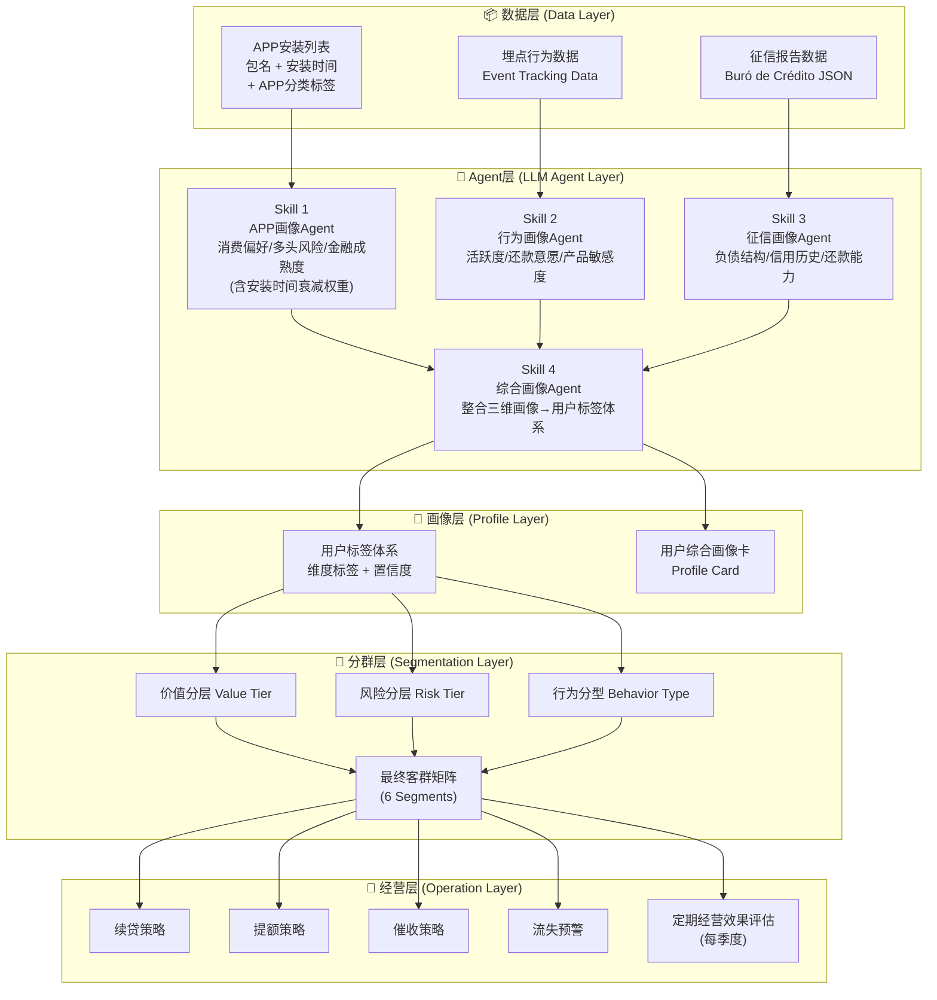

# 基于大模型的用户画像与客群分层方案（墨西哥市场）

这份方案在菲律宾市场框架的基础上，针对墨西哥市场的数据特点（APP包名+安装时间、本地化APP生态、西语征信报告结构）进行了全面适配。核心思路不变：**用 LLM Agent 将三类原始数据转化为"人话版"用户画像，再基于画像进行稳定的客群分层与定期经营效果评估。**

---

## 一、核心判断（墨西哥市场）

1. **数据环境**：墨西哥金融渗透率偏低，Buró de Crédito（征信局）覆盖有限，大量用户为 thin-file 甚至 no-file，APP 行为数据和埋点数据是核心差异化信息源。
2. **APP 数据特色**：墨西哥市场可获取 **APP 包名 + 安装时间**，安装时间与进件时间的间隔是判断用户当前意图的关键信号。
3. **分层稳定性**：用户分层为低频操作，建议 **每季度** 重新评估一次，日常以经营效果分析为主，避免频繁调整分层带来的策略混乱。
4. **合规要求**：需遵循墨西哥 LFPDPPP（联邦个人数据保护法）相关规定，确保数据采集和使用合规。

---

## 二、整体方案架构



---

## 三、Skill 1：APP画像Agent（墨西哥本地化）

### 3.1 数据输入结构

Skill 1 的输入不仅包含 APP 列表，还包含 **安装时间** 和 **APP 分类标签**，这是墨西哥市场的关键差异点。

```json
{
  "user_id": "MX_USER_XXXXX",
  "application_time": "2026-03-20T14:30:00",
  "app_list": [
    {
      "package_name": "com.mercadolibre",
      "app_name": "Mercado Libre",
      "category": "电商消费",
      "install_time": "2025-11-05T08:00:00"
    },
    {
      "package_name": "com.kueski.app",
      "app_name": "Kueski",
      "category": "借贷工具",
      "install_time": "2026-03-18T10:22:00"
    },
    {
      "package_name": "com.bbva.bbvanet",
      "app_name": "BBVA México",
      "category": "银行应用",
      "install_time": "2024-06-15T09:00:00"
    }
  ]
}
```

### 3.2 墨西哥本地化APP分类词典

| APP类别 | 代表APP（墨西哥） | 画像信号 |
|---|---|---|
| **电商消费** | Mercado Libre, Amazon MX, Shein | 消费能力、消费偏好 |
| **外卖/出行** | Uber, DiDi, Rappi, Uber Eats | 生活水平、城市化程度 |
| **竞品借贷** | Kueski, Moneyman, Creditea, Dineria, Okredito | **多头借贷风险**、价格敏感度 |
| **社交媒体** | Facebook, WhatsApp, TikTok, Instagram | 社交活跃度、年龄层判断 |
| **银行/金融** | BBVA, Banorte, Nu México, Mercado Pago, Stori | 金融成熟度、银行化程度 |
| **游戏娱乐** | Free Fire, Mobile Legends, Clash Royale | 冲动消费倾向、年轻用户标识 |
| **教育/职业** | Coursera, LinkedIn, Platzi | 学习意愿、职业发展潜力 |
| **政府/公共服务** | SAT Móvil, IMSS Digital, Mi Beca | 正规就业信号、政府福利依赖度 |
| **汇款** | Remitly, Wise, Western Union | 海外亲属汇款、收入来源多样性 |

### 3.3 安装时间衰减权重机制

安装时间与进件时间的间隔直接影响该 APP 对用户当前状态的代表性：

| 安装时间距进件时间 | 权重等级 | 说明 |
|:---:|:---:|---|
| ≤ 7 天 | 🔴 **极高权重** | 近期密集安装借贷APP = 强多头信号 |
| 8–30 天 | 🟠 **高权重** | 近期行为，反映当前意图 |
| 31–90 天 | 🟡 **中权重** | 中期行为，有参考价值 |
| 91–365 天 | 🟢 **低权重** | 历史行为，作为背景参考 |
| > 365 天 | ⚪ **极低权重** | 长期安装，可能已不活跃 |

**关键规则**：若用户在进件前 7 天内安装了 ≥3 个竞品借贷 APP，直接标记为 **"近期多头高风险"**。

### 3.4 Skill 1 完整 Prompt

```markdown
# Role
你是一位墨西哥消费金融市场的APP行为分析专家。

# Task
根据用户的APP安装列表（含包名、分类、安装时间）和进件时间，输出用户画像标签。

# Input
- 进件时间: {{application_time}}
- APP列表: {{app_list}}  (每条包含 package_name, app_name, category, install_time)

# Analysis Steps

## Step 1: 时间权重计算
对每个APP，计算其安装时间与进件时间的间隔天数，按以下规则赋予权重：
- ≤7天 → 极高权重
- 8-30天 → 高权重
- 31-90天 → 中权重
- 91-365天 → 低权重
- >365天 → 极低权重

## Step 2: 多头借贷风险评估
- 统计"借贷工具"类APP的数量及安装时间分布
- 重点关注近30天内新安装的借贷APP
- 输出多头风险等级: 高/中/低
- 给出判断依据（如："进件前5天内安装了Kueski和Moneyman，呈现密集借贷申请行为"）

## Step 3: 消费能力评估
- 基于电商、外卖、出行类APP的种类和层级判断消费水平
- 高权重APP优先参考
- 输出消费能力标签: 高/中偏上/中/中偏下/低

## Step 4: 金融成熟度评估
- 是否安装银行APP（BBVA, Banorte, Nu等）
- 是否使用电子钱包（Mercado Pago等）
- 是否有政府服务APP（SAT Móvil = 有RFC税号 = 正规就业信号）
- 输出金融成熟度: 银行化用户 / 半银行化用户 / 非银行化用户

## Step 5: 生活方式标签
综合所有APP信息，输出2-4个生活方式标签，例如：
- "城市白领型"、"蓝领务工型"、"学生/年轻自由职业者"、"家庭消费型"等

# Output Format (JSON)
{
  "user_id": "...",
  "analysis_time": "...",
  "multi_head_risk": {
    "level": "高/中/低",
    "lending_app_count": 3,
    "recent_7d_lending_apps": ["Kueski", "Moneyman"],
    "reasoning": "进件前5天内密集安装2个借贷APP，显示短期资金饥渴"
  },
  "consumption_ability": {
    "level": "中偏上",
    "reasoning": "安装Mercado Libre和Rappi，有中等以上线上消费习惯"
  },
  "financial_maturity": {
    "level": "银行化用户",
    "has_bank_app": true,
    "has_ewallet": true,
    "has_gov_app": true,
    "reasoning": "安装BBVA和SAT Móvil，具备正规银行账户和税务登记"
  },
  "lifestyle_tags": ["城市白领型", "中产消费"],
  "confidence": "高",
  "key_signals": [
    "BBVA安装超1年，长期银行用户",
    "Kueski近期安装，存在比价行为",
    "有SAT Móvil，大概率正规就业"
  ]
}

# Important Rules
1. 安装时间越近的APP权重越高，分析时必须体现时间衰减逻辑
2. 输出必须包含reasoning字段，解释判断依据
3. 置信度根据APP数据的丰富程度给出: 高(≥10个APP) / 中(5-9个) / 低(<5个)
4. 未知或无法分类的APP不参与核心判断，但可作为补充信息提及
```

---

## 四、Skill 2：埋点行为画像Agent（墨西哥市场）

### 4.1 核心行为维度

| 行为维度 | 具体埋点事件 | 画像含义 |
|---|---|---|
| **还款行为** | 还款页访问频次、提前还款、还款时间点（发薪日前后） | 还款意愿强弱 |
| **产品探索** | 提额页访问、产品详情页停留时长、利率计算器使用 | 续贷/提额意愿 |
| **活跃度** | 日均启动次数、最近活跃时间、Session 时长 | 流失风险预警 |
| **客服接触** | 投诉记录、在线客服会话、FAQ 浏览 | 满意度/风险信号 |
| **通知响应** | Push 打开率、WhatsApp 消息点击率、SMS 点击 | 触达渠道偏好 |
| **认证行为** | 身份认证完成度、银行卡绑定、补充资料意愿 | 信任度/转化意愿 |

### 4.2 墨西哥市场特殊行为信号

- **发薪日效应**：墨西哥常见双周发薪（Quincena，每月 15 号和月末），还款行为与发薪日的关系是判断还款能力的重要信号。
- **WhatsApp 偏好**：墨西哥用户高度依赖 WhatsApp，触达渠道应优先考虑 WhatsApp Business。
- **节假日行为**：Buen Fin（墨西哥"黑五"，11月中旬）、Navidad 等节日前后消费行为会出现明显波动。

### 4.3 Skill 2 Prompt 设计

```markdown
# Role
你是一位墨西哥消费金融产品的用户行为分析专家。

# Task
根据用户的埋点行为数据，输出行为画像标签。

# Input
- 用户ID: {{user_id}}
- 分析时间窗口: 近30天
- 行为事件列表: {{event_list}}
  (每条包含 event_name, event_time, event_params)

# Analysis Steps

## Step 1: 还款意愿评估
- 分析还款页访问频率和时间分布
- 是否有提前还款行为
- 还款时间与Quincena（发薪日: 15号/月末）的关系
- 输出还款意愿: 强(★★★★★) / 较强(★★★★☆) / 中(★★★☆☆) / 弱(★★☆☆☆) / 极弱(★☆☆☆☆)

## Step 2: 产品意愿评估
- 提额页/续贷页访问次数和停留时长
- 利率计算器使用情况
- 是否有未完成的申请流程
- 输出: 提额意愿(高/中/低) + 续贷意愿(高/中/低)

## Step 3: 流失风险评估
- 最近一次活跃距今天数
- 近30天活跃天数趋势（上升/平稳/下降）
- 与竞品APP行为的时间重叠（如有）
- 输出流失风险: 高/中/低

## Step 4: 触达偏好
- Push/WhatsApp/SMS 各渠道的打开率
- 最佳触达时间段
- 输出最优触达渠道和时间建议

## Step 5: 综合行为画像
用一段自然语言总结该用户的行为特征，包含经营建议。

# Output Format (JSON)
{
  "user_id": "...",
  "repayment_willingness": {
    "score": "★★★★☆",
    "label": "较强",
    "reasoning": "近30天内3次主动访问还款页，且均在发薪日后1-2天内完成还款"
  },
  "product_intent": {
    "upgrade_intent": "高",
    "reloan_intent": "中",
    "reasoning": "2次访问提额页，平均停留45秒，但未提交申请"
  },
  "churn_risk": {
    "level": "低",
    "last_active_days_ago": 2,
    "active_trend": "平稳",
    "reasoning": "近30天活跃18天，无明显下降趋势"
  },
  "contact_preference": {
    "best_channel": "WhatsApp",
    "best_time": "晚间19:00-21:00",
    "push_open_rate": "32%"
  },
  "behavior_summary": "该用户还款习惯良好，与发薪周期高度吻合，近期对提额有明确兴趣但犹豫未申请，建议通过WhatsApp在晚间推送定向提额优惠以促进转化。",
  "confidence": "高"
}
```

---

## 五、Skill 3：征信画像Agent（墨西哥 Buró de Crédito）

### 5.1 征信数据预处理

墨西哥征信数据来源于 **Buró de Crédito**，通常以较长的 JSON 字符串返回。在输入 LLM 之前需要进行 **结构化清洗**：

```
原始征信JSON → 清洗脚本 → 结构化摘要 → 输入Skill 3 Prompt
```

**清洗规则**：

| 清洗步骤 | 操作 | 目的 |
|---|---|---|
| 1. 字段筛选 | 仅保留核心字段（账户、逾期、查询等） | 减少 Token 消耗 |
| 2. 数值聚合 | 计算总负债、总账户数、平均账龄等 | 便于 LLM 理解 |
| 3. 逾期标准化 | 将逾期代码转为自然语言描述 | 提高 LLM 解读准确性 |
| 4. 查询记录汇总 | 按近3/6/12个月分段统计查询次数 | 判断借贷饥渴度 |

### 5.2 清洗后的结构化输入示例

```json
{
  "user_id": "MX_USER_XXXXX",
  "credit_report_date": "2026-03-20",
  "summary": {
    "total_accounts": 5,
    "active_accounts": 3,
    "closed_accounts": 2,
    "oldest_account_age_months": 48,
    "total_outstanding_debt_mxn": 35000,
    "monthly_payment_estimate_mxn": 4200
  },
  "delinquency": {
    "total_delinquent_accounts": 1,
    "max_delinquency_days": 30,
    "most_recent_delinquency": "2025-08-15",
    "delinquency_history": [
      {"account": "Tarjeta BBVA", "days_past_due": 30, "date": "2025-08-15", "status": "已还清"}
    ]
  },
  "inquiries": {
    "last_3_months": 4,
    "last_6_months": 7,
    "last_12_months": 10,
    "inquiry_sources": ["Kueski", "Moneyman", "Creditea", "BBVA"]
  },
  "account_details": [
    {
      "institution": "BBVA",
      "type": "信用卡",
      "credit_limit_mxn": 25000,
      "current_balance_mxn": 12000,
      "utilization_rate": "48%",
      "payment_status": "正常",
      "account_age_months": 48
    },
    {
      "institution": "Nu México",
      "type": "信用卡",
      "credit_limit_mxn": 8000,
      "current_balance_mxn": 6500,
      "utilization_rate": "81%",
      "payment_status": "正常",
      "account_age_months": 12
    },
    {
      "institution": "Kueski",
      "type": "消费贷款",
      "original_amount_mxn": 5000,
      "current_balance_mxn": 3500,
      "payment_status": "正常",
      "account_age_months": 3
    }
  ]
}
```

### 5.3 核心分析维度

| 征信维度 | 分析要点 | 画像输出 |
|---|---|---|
| **账户数量与类型** | 银行卡 vs 消费贷款 vs 零售分期 | 金融成熟度 |
| **负债结构** | 总负债/月还款额、信用卡使用率 | 还款压力指数 |
| **历史逾期** | 逾期次数、最大逾期天数、最近逾期时间 | 信用稳定性 |
| **查询记录** | 近3/6/12个月查询次数及来源 | 借贷饥渴度 |
| **账户年龄** | 最老账户开立时间 | 信用历史厚度 |
| **信用卡使用率** | 额度使用比例 | 资金紧张程度 |

### 5.4 Skill 3 完整 Prompt

```markdown
# Role
你是一位墨西哥消费信贷领域的征信报告分析专家，擅长解读Buró de Crédito数据。

# Task
根据用户的结构化征信摘要，输出征信画像标签和风险判断。

# Input
- 用户ID: {{user_id}}
- 征信摘要: {{credit_report_summary}} (JSON格式，已清洗)

# Analysis Steps

## Step 1: 金融成熟度评估
- 总账户数和账户类型分布
- 最老账户年龄
- 是否有银行信用卡（vs 仅有消费贷款）
- 输出金融成熟度: 成熟(≥3年信用历史+银行卡) / 成长中(1-3年) / 薄信用(<1年) / 无记录

## Step 2: 负债压力评估
- 总负债金额 vs 月还款估算
- 信用卡使用率（>70%为高压信号）
- 是否存在多笔在贷消费贷款
- 输出负债压力: 高/中/低
- 给出DTI(Debt-to-Income)粗略估算建议

## Step 3: 信用稳定性评估
- 历史逾期次数和严重程度
- 最近一次逾期距今时间
- 逾期后是否已还清
- 输出信用稳定性: 优秀/良好/一般/较差/差

## Step 4: 借贷饥渴度评估
- 近3个月查询次数（≥3次为高饥渴）
- 近6个月查询次数（≥5次为高饥渴）
- 查询来源是否多为线上消费贷款公司
- 输出借贷饥渴度: 高/中/低

## Step 5: 综合征信画像
用一段自然语言总结该用户的信用状况，包含风险提示和经营建议。

# Output Format (JSON)
{
  "user_id": "...",
  "financial_maturity": {
    "level": "成熟",
    "credit_history_years": 4,
    "has_bank_credit_card": true,
    "reasoning": "拥有BBVA信用卡4年，信用历史较厚"
  },
  "debt_pressure": {
    "level": "中",
    "total_debt_mxn": 35000,
    "monthly_payment_mxn": 4200,
    "avg_credit_utilization": "58%",
    "reasoning": "Nu信用卡使用率81%偏高，但BBVA卡使用率48%尚可，整体负债中等"
  },
  "credit_stability": {
    "level": "良好",
    "total_delinquencies": 1,
    "max_dpd": 30,
    "months_since_last_delinquency": 7,
    "reasoning": "仅1次30天逾期且已还清，距今7个月，整体信用记录良好"
  },
  "borrowing_urgency": {
    "level": "高",
    "inquiries_3m": 4,
    "inquiries_6m": 7,
    "inquiry_sources_type": "主要为线上消费贷款",
    "reasoning": "近3个月4次查询，且来源包括Kueski、Moneyman等多家线上贷款，多头申请明显"
  },
  "credit_summary": "该用户具备4年信用历史，有BBVA银行信用卡，信用基础扎实。但近期借贷查询频繁（3个月4次），Nu信用卡使用率偏高（81%），显示短期资金压力增大。历史仅1次轻微逾期已还清，整体信用稳定性良好。建议：可授信但需控制额度，关注多头风险。",
  "confidence": "高",
  "risk_flags": [
    "近3个月查询次数偏高(4次)",
    "Nu信用卡使用率81%，接近上限",
    "近期新增Kueski消费贷款"
  ]
}

# Important Rules
1. 若征信数据为空或字段缺失，输出"无征信记录"并标注confidence为"低"，建议依赖Skill 1和Skill 2进行判断
2. 所有金额单位为MXN（墨西哥比索）
3. 必须输出risk_flags字段，列出所有值得关注的风险信号
4. reasoning字段需用具体数据支撑，不能泛泛而谈
```

---

## 六、Skill 4：综合画像Agent

### 6.1 整合逻辑

Skill 4 接收前三个 Skill 的输出，进行 **三维画像融合**，解决信号冲突并输出最终用户标签。

**信号冲突处理优先级**：

| 冲突场景 | 处理规则 |
|---|---|
| Skill 1 显示多头高风险，Skill 3 征信良好 | 以 Skill 3 为主，Skill 1 作为预警补充 |
| Skill 3 无征信记录 | 以 Skill 1 + Skill 2 为主，降低整体置信度 |
| Skill 2 显示高活跃，Skill 1 显示竞品APP多 | 综合判断为"价格敏感型活跃用户"，非简单高风险 |
| 三个Skill信号一致 | 提高置信度至"高" |

### 6.2 Skill 4 完整 Prompt

```markdown
# Role
你是一位墨西哥消费金融市场的用户画像综合分析专家。你需要整合APP画像、行为画像和征信画像三个维度的分析结果，输出最终的用户综合画像卡和客群分类建议。

# Task
根据Skill 1（APP画像）、Skill 2（行为画像）、Skill 3（征信画像）的输出结果，生成用户综合画像卡。

# Input
- 用户ID: {{user_id}}
- Skill 1 输出: {{skill1_output}}
- Skill 2 输出: {{skill2_output}}
- Skill 3 输出: {{skill3_output}}

# Analysis Steps

## Step 1: 信号一致性检查
- 对比三个Skill的核心判断是否一致
- 识别信号冲突点（如APP显示多头但征信良好）
- 对冲突信号给出合理解释

## Step 2: 综合风险评估
整合以下信号：
- Skill 1: 多头风险等级 + 金融成熟度
- Skill 2: 还款意愿 + 流失风险
- Skill 3: 信用稳定性 + 负债压力 + 借贷饥渴度
输出综合风险等级: 低风险 / 中低风险 / 中风险 / 中高风险 / 高风险

## Step 3: 综合价值评估
整合以下信号：
- Skill 1: 消费能力 + 生活方式
- Skill 2: 产品意愿（提额/续贷）+ 活跃度
- Skill 3: 金融成熟度 + 信用历史厚度
输出综合价值等级: 高价值 / 中高价值 / 中价值 / 低价值

## Step 4: 客群分类建议
根据综合风险和综合价值，建议归入以下客群之一：
- S1 优质成长客: 高价值 + 低风险
- S2 稳健经营客: 中高价值 + 中低风险
- S3 价格敏感客: 中价值 + 有竞品信号
- S4 潜在流失客: 活跃度下降 + 有竞品
- S5 多头高风客: 高借贷饥渴度 + 高负债
- S6 沉默观望客: 低活跃 + 按时还款

## Step 5: 生成综合画像卡
用结构化格式输出完整画像卡，包含经营策略建议。

# Output Format (JSON)
{
  "user_id": "...",
  "profile_generated_at": "...",
  "basic_tags": {
    "age_range": "28-35岁",
    "age_confidence": "中",
    "occupation_type": "正规就业/白领",
    "occupation_confidence": "高",
    "region": "墨西哥城都会区",
    "banking_level": "银行化用户"
  },
  "behavior_tags": {
    "repayment_willingness": "★★★★☆ 较强",
    "product_activity": "★★★★☆ 较高",
    "churn_risk": "低",
    "best_contact_channel": "WhatsApp",
    "best_contact_time": "晚间19:00-21:00"
  },
  "financial_tags": {
    "multi_head_risk": "中",
    "debt_pressure": "中",
    "consumption_ability": "中偏上",
    "credit_stability": "良好",
    "borrowing_urgency": "高"
  },
  "signal_conflicts": [
    {
      "conflict": "APP显示近期安装多个借贷APP(多头中风险)，但征信信用稳定性良好",
      "resolution": "判断为近期资金需求增加的比价行为，非恶意多头，但需持续监控"
    }
  ],
  "overall_risk": "中低风险",
  "overall_value": "中高价值",
  "recommended_segment": "S2",
  "segment_name": "稳健经营客",
  "comprehensive_summary": "该用户为墨西哥城地区的银行化白领用户，拥有4年信用历史，BBVA信用卡使用正常。近期出现多平台借贷查询，但历史还款记录良好（仅1次30天逾期已还清），判断为短期资金需求增加而非信用恶化。APP行为显示有提额意愿，建议作为稳健经营客进行定期触达，提供适度提额方案以增强粘性，同时监控多头借贷趋势。",
  "operation_suggestions": [
    "通过WhatsApp在晚间推送续贷/提额信息",
    "提供比竞品(Kueski)更优的利率方案",
    "每季度复评多头风险，若查询次数持续上升则调整为S5"
  ],
  "confidence": "高",
  "data_completeness": {
    "skill1_available": true,
    "skill2_available": true,
    "skill3_available": true,
    "note": "三维数据完整，画像置信度高"
  }
}

# Important Rules
1. 当Skill 3无征信数据时，整体置信度不得高于"中"，并在note中注明
2. 信号冲突必须在signal_conflicts中明确列出并给出resolution
3. operation_suggestions必须具体可执行，不能泛泛而谈
4. 客群分类必须从S1-S6中选择一个，并说明理由
5. 所有reasoning和summary必须用数据支撑
```

---

## 七、用户综合画像卡示例（墨西哥市场）

```
用户ID: MX_USER_78432
画像生成时间: 2026-03-26

══════════════════════════════════════
【基础标签】
- 年龄层: 28-35岁 (中置信度，基于APP组合推断)
- 职业类型: 正规就业/白领 (高置信度，安装SAT Móvil)
- 地理区域: 墨西哥城都会区 (高置信度)
- 银行化程度: 银行化用户 (有BBVA信用卡4年)

【行为标签】
- 还款意愿: ★★★★☆ 较强 (发薪日后1-2天主动还款)
- 产品活跃度: ★★★★☆ 较高 (2次访问提额页)
- 流失风险: 低 (近30天活跃18天)
- 最佳触达: WhatsApp / 晚间19-21点

【财务标签】
- 多头借贷风险: 中 (近3月4次查询，安装Kueski)
- 负债压力: 中等 (Nu卡使用率81%偏高)
- 消费能力: 中等偏上 (Mercado Libre + Rappi用户)
- 信用稳定性: 良好 (仅1次30天逾期已还清)
- 借贷饥渴度: 高 (近期密集查询)

【信号冲突说明】
⚠️ APP显示近期安装竞品借贷APP，但征信历史良好
→ 判断：近期资金需求增加的比价行为，非恶意多头

【综合判断】
客群归属: S2 稳健经营客
综合风险: 中低
综合价值: 中高

该用户为典型的城市银行化白领，信用基础扎实，
近期资金需求增加导致多平台比价，但整体风险可控。
建议策略：主动触达+提供有竞争力的利率方案+适度提额，
以增强用户粘性，防止流失至竞品平台。

下次复评时间: 2026-06-26 (季度复评)
══════════════════════════════════════
```

---

## 八、客群分层矩阵（墨西哥市场核心交付物）

基于 **价值维度 × 风险维度** 构建 **6 类客群**：

| 客群编号 | 客群名称 | 特征描述 | 占比估算 | 核心经营策略 |
|:---:|---|---|:---:|---|
| **S1** | 🌟 **优质成长客** | 高活跃、低风险、有提额意愿、征信良好、银行化用户 | ~15% | 主动提额、VIP 服务、长期留存、推荐奖励 |
| **S2** | 💪 **稳健经营客** | 按时还款、中等活跃、信用稳定、无严重多头 | ~30% | 定期 WhatsApp 触达、续贷优惠、口碑传播 |
| **S3** | 🎯 **价格敏感客** | 安装竞品APP、还款正常但在比价、对利率敏感 | ~20% | 利率优惠券、限时活动、Buen Fin 专属方案 |
| **S4** | ⚠️ **潜在流失客** | 活跃度下降、近期无登录、安装竞品APP | ~15% | 流失预警触达、挽回优惠、WhatsApp 专属关怀 |
| **S5** | 🔍 **多头高风客** | 多个借贷APP近期安装、查询次数多、负债高 | ~10% | 控额不提额、加强还款提醒、缩短账期 |
| **S6** | 😴 **沉默观望客** | 低活跃、按时还款、无互动、无明显意图 | ~10% | 轻触达、场景化唤醒（如 Buen Fin 消费场景） |

---

## 九、标签体系设计（业务团队可用版）

为确保业务团队能直接查看和使用画像结果，设计以下标准化标签体系：

### 9.1 标签分类总览

| 标签大类 | 标签维度 | 标签值示例 | 更新频率 |
|---|---|---|---|
| **基础属性** | 年龄层 | 18-25 / 26-35 / 36-45 / 45+ | 季度 |
| | 职业类型 | 正规就业 / 非正规就业 / 自由职业 / 学生 | 季度 |
| | 银行化程度 | 银行化 / 半银行化 / 非银行化 | 季度 |
| | 地理区域 | 墨西哥城 / 蒙特雷 / 瓜达拉哈拉 / 其他 | 静态 |
| **风险标签** | 多头风险 | 高 / 中 / 低 | 季度 |
| | 信用稳定性 | 优秀 / 良好 / 一般 / 较差 / 差 | 季度 |
| | 负债压力 | 高 / 中 / 低 | 季度 |
| | 借贷饥渴度 | 高 / 中 / 低 | 季度 |
| **行为标签** | 还款意愿 | ★1-5 | 季度 |
| | 提额意愿 | 高 / 中 / 低 | 季度 |
| | 流失风险 | 高 / 中 / 低 | 月度监控 |
| | 触达偏好 | WhatsApp / Push / SMS | 季度 |
| **价值标签** | 消费能力 | 高 / 中偏上 / 中 / 中偏下 / 低 | 季度 |
| | 生活方式 | 城市白领 / 蓝领务工 / 年轻自由职业 等 | 季度 |
| | 客群归属 | S1-S6 | 季度 |
| **元数据** | 画像置信度 | 高 / 中 / 低 | 每次生成 |
| | 数据完整度 | 三维完整 / 缺征信 / 仅APP数据 | 每次生成 |

### 9.2 业务查询界面建议

业务团队可通过以下方式使用标签：

- **筛选器**：按客群（S1-S6）、风险等级、价值等级筛选用户列表
- **画像卡**：点击单个用户查看完整 Profile Card（含自然语言总结）
- **批量导出**：按客群导出用户列表用于营销活动
- **趋势看板**：各客群占比变化趋势（季度对比）

---

## 十、技术实现路径（墨西哥市场务实版）

```
阶段一（1-2个月）：数据准备 + Prompt工程
├── 整理墨西哥APP分类词典（含包名→分类映射表）
├── 设计安装时间衰减权重算法
├── 编写Buró de Crédito JSON清洗脚本
├── 定义埋点事件→业务含义映射表
├── 设计并测试4个Skill的Prompt（含边界case）
└── 输出: APP词典 + 征信清洗模板 + 4份Prompt

阶段二（2-3个月）：Agent开发 + 小规模验证
├── 开发4个Skill的LLM调用链路（建议用LangChain/类似框架）
├── 实现征信JSON→结构化摘要的自动化pipeline
├── 选取1000-2000个续贷用户做画像验证
├── 人工抽检画像准确率（目标>75%）
├── 与业务团队共同校准客群定义
└── 输出: 第一版客群分层结果 + 准确率报告

阶段三（3-4个月）：经营闭环验证
├── 针对S1-S6客群设计差异化经营动作
├── A/B测试不同客群的触达策略
├── 建立季度经营效果评估机制
├── 核心指标: 续贷率 / 提额转化率 / 逾期率 / 流失率
└── 输出: 首次季度经营效果报告 + 方案迭代建议
```

---

## 十一、专家避坑清单（墨西哥市场特别版）

| 序号 | 风险点 | 建议 |
|:---:|---|---|
| 1 | **APP列表时效性** | 取最近 30 天安装列表，重点关注进件前 7 天的新安装 APP |
| 2 | **征信覆盖盲区** | 墨西哥约 30-40% 用户无 Buró 记录，需设计降级逻辑（仅用 Skill 1+2） |
| 3 | **画像≠评分** | 输出是定性标签+置信度，不要试图直接输出信用分数 |
| 4 | **客群非静态** | 每季度复评一次客群归属，但日常监控流失风险（月度） |
| 5 | **Quincena效应** | 发薪日（15号/月末）前后行为差异大，行为分析需考虑薪资周期 |
| 6 | **Buen Fin 干扰** | 11月中旬大促期间消费行为异常，画像模型需排除或标注 |
| 7 | **WhatsApp 优先** | 墨西哥用户触达首选 WhatsApp Business，Push 和 SMS 为辅 |
| 8 | **数据合规** | 遵循 LFPDPPP（联邦个人数据保护法），APP 列表采集需用户授权 |
| 9 | **Token 成本控制** | 征信 JSON 清洗后再输入 LLM，避免原始长文本浪费 Token |
| 10 | **LLM 幻觉风险** | 对 LLM 输出设置 schema 校验，异常值自动标记人工复核 |

---

## 十二、方案价值总结

> **用大模型做的不是传统的特征工程，而是给每个用户写一份"人话版分析报告"，让业务团队真正理解用户是谁、该怎么经营他。**

这套方案的核心优势：

- **三维数据融合**：APP 安装行为（含时间衰减）+ 产品内埋点行为 + Buró de Crédito 征信，三个维度交叉验证，提高画像可靠性
- **本地化深度适配**：墨西哥 APP 生态词典、Quincena 发薪周期、WhatsApp 触达偏好、LFPDPPP 合规要求全部纳入
- **稳定分层 + 定期评估**：客群分层为季度低频操作，日常聚焦经营效果分析，避免策略混乱
- **可解释性强**：每个标签都有 reasoning 支撑，业务团队可以理解并信任画像结果
- **降级容错**：征信缺失时自动降级为双维画像，确保所有用户都能获得基本画像